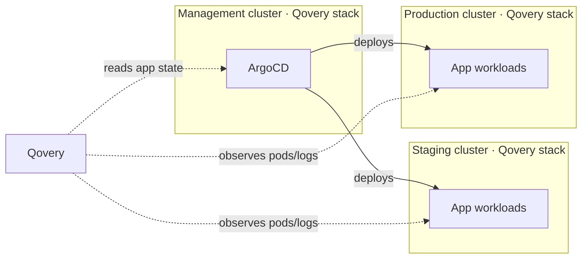

<Warning>
  This feature is currently in **beta**. Behavior and configuration options may change in future releases.
</Warning>

## Overview
Qovery's ArgoCD integration bridges GitOps-driven deployments with Qovery's platform capabilities. Deployment ownership remains in ArgoCD — your teams continue using GitOps workflows as usual — while Qovery provides a unified view across all your environments and surfaces platform features that ArgoCD doesn't natively offer.

**What you get with the integration:**

- **Unified environment visibility** — ArgoCD applications appear as Qovery environments, organized by namespace.
- **Pod management** — View pod statuses and open a shell directly from Qovery.
- **Log streaming** — Access real-time logs for ArgoCD-managed workloads.
- **Sync status** — Qovery reflects the current ArgoCD sync and health status of each application.

ArgoCD-managed services are largely **read-only** in Qovery — configuration and manifests stay in Git. Convenience [Sync and Rollback actions](#actions) on the ArgoCD application are planned (coming soon during beta).

## Prerequisites

- A Qovery cluster that is **already added to Qovery** and hosts the ArgoCD instance. See [Clusters configuration](/configuration/clusters).
- An ArgoCD instance reachable from the Qovery cluster agent running in the `qovery` namespace of that cluster.
- An ArgoCD API token with read access to applications and logs.

### Create a dedicated ArgoCD user

We recommend creating a dedicated service account rather than using an admin token.

**1. Add the account to `argocd-cm`**

```yaml
apiVersion: v1
kind: ConfigMap
metadata:
  name: argocd-cm
  namespace: argocd
  labels:
    app.kubernetes.io/name: argocd-cm
    app.kubernetes.io/part-of: argocd
data:
  accounts.qovery: apiKey
  accounts.qovery.enabled: "true"
  ...
```


**2. Grant read-only RBAC permissions in `argocd-rbac-cm`**

```yaml
apiVersion: v1
kind: ConfigMap
metadata:
  name: argocd-rbac-cm
  namespace: argocd
data:
  policy.csv: |
    p, qovery, applications, get, *, allow
```


**3. Generate the token**

```bash
argocd login <your-argocd-url>
argocd account generate-token --account qovery
```

Copy the token printed to the terminal — you will need it during configuration.

**4. Verify permissions**

```bash
argocd account can-i --auth-token <token> get applications '*'   # should return: yes
argocd account can-i --auth-token <token> delete applications '*' # should return: no
```

## Configuration

The ArgoCD integration is configured at the **organization level** under **Settings → ArgoCD integration**. Each ArgoCD instance can be mapped to a Qovery cluster.

### Step 1: Connect an ArgoCD instance

<Steps>
  <Step title="Open ArgoCD settings">
    In the [Qovery Console](https://console.qovery.com), go to **Settings** → **ArgoCD integration**.
  </Step>
  <Step title="Add a new integration">
    Click **Add ArgoCD** and fill in:

    | Field | Description | Example |
    |---|---|---|
    | **Target cluster** | A cluster already added to Qovery — the one where ArgoCD itself is running. If your ArgoCD instance deploys to multiple clusters, also see [Step 2](#step-2-map-destination-clusters-multi-cluster-argocd). | My Production Cluster |
    | **ArgoCD API URL** | The in-cluster URL of the ArgoCD API server. It must be reachable from the Qovery cluster-agent running in the `qovery` namespace, so the **internal Kubernetes service URL** is the right choice. A public ingress URL also works but is not required. | `http://argocd-server.argocd.svc.cluster.local/` or `http://argocd-server.argocd/` |
    | **Access token** | The token generated from the dedicated `qovery` ArgoCD user (see [Create a dedicated ArgoCD user](#create-a-dedicated-argocd-user)). Do not use an admin token. | `xxxxxx` |

    <Note>
      The token is the one printed by `argocd account generate-token --account qovery` during the prerequisites step. For ingress URL configuration, see the [ArgoCD ingress guide](https://argo-cd.readthedocs.io/en/stable/operator-manual/ingress/#ui-and-api-content-path).
    </Note>
  </Step>
  <Step title="Validate and save">
    Qovery tests the connection before saving credentials. If validation fails, you will see one of these errors:

    | Error | Cause |
    |---|---|
    | **Could not reach this ArgoCD URL** | The endpoint is unreachable from the cluster network. Verify the URL and network access. |
    | **Token was rejected** | The token is invalid or expired. Generate a new token and try again. |
    | **Insufficient permissions** | The token does not have read access to ArgoCD applications. |

    Once validated, the integration is saved and Qovery begins discovering applications automatically.
  </Step>
</Steps>

<Warning>
  ArgoCD tokens are stored securely and are never returned in plain text via the Qovery API — the token field always appears as `REDACTED`. Treat your token as a secret and rotate it in ArgoCD if it is compromised, then update the integration.
</Warning>

### Step 2: Map destination clusters (multi-cluster ArgoCD)

A common ArgoCD topology is a **central ArgoCD instance** driving applications across **several destination Kubernetes clusters** (for example one ArgoCD on a management cluster deploying to staging and production clusters). Qovery supports this setup, but it requires two things.

**Install the Qovery stack on every cluster.** Both the cluster hosting ArgoCD *and* every destination cluster must run the Qovery stack:

- The cluster running ArgoCD lets Qovery read application configuration and sync status from the ArgoCD API.
- Each destination cluster lets Qovery observe the actual workloads — pods, logs, metrics — for the applications ArgoCD deploys there.

**Map ArgoCD destination clusters to Qovery clusters.** From the integration's settings page, map each ArgoCD destination cluster name to the matching Qovery cluster. Without this mapping, Qovery cannot reconcile an application back to the right environment and cluster.



If ArgoCD only deploys to the cluster it is installed on, you can skip this step.

## Environment Visibility

Once connected, Qovery automatically discovers ArgoCD applications and organizes them into environments — no manual configuration required.

### Project and environment creation

Qovery creates a dedicated project named **"Qovery ArgoCD Integration"** in your organization. Within this project, each unique ArgoCD destination namespace becomes a Qovery environment.

**Environment type** is assigned automatically based on the target cluster:
- **PRODUCTION** — if the Qovery cluster is marked as a production cluster
- **STAGING** — for all other clusters

### Importing state

Immediately after connecting, the integration shows an **"Importing ArgoCD…"** state while the cluster agent polls ArgoCD for the first time. This resolves automatically within a few minutes as applications are discovered.

### Services

Each ArgoCD application within a namespace appears as a service inside the corresponding Qovery environment. The service list shows:

| Column | Description |
|---|---|
| **Service** | The ArgoCD application name |
| **Last operation** | The most recent ArgoCD sync status |
| **Target version** | The Git revision or tag currently deployed |

<Note>
  Configuration and deployment manifests of ArgoCD-managed services stay **read-only** in Qovery — all changes must continue to go through your GitOps pipeline. The [Sync and Rollback actions](#actions) are planned exceptions and trigger ArgoCD on your behalf.
</Note>

## Monitoring & debugging

Qovery surfaces the same observability primitives for ArgoCD-managed workloads as it does for native Qovery services:

- **Pod metrics** — CPU and memory at the pod level, via the same metrics pipeline used for native Qovery services.
- **Logs streaming** — real-time container logs for ArgoCD-managed workloads.
- **Pod shell access** — open a shell into a running container directly from the Qovery Console.
- **Sync & health status** — Qovery mirrors ArgoCD's current sync and health status for each application.

<Note>
  Full **Qovery Observe** integration for ArgoCD-managed apps — alerts, events, 12-week log retention, service health dashboards — is **in progress** and will be enabled progressively.
</Note>

## Actions

ArgoCD remains the source of truth for what gets deployed. To save round-trips to the ArgoCD UI, Qovery exposes convenience actions that call the ArgoCD API on your behalf:

| Action | What it does |
|---|---|
| **Sync** | Triggers an ArgoCD `app sync` for the selected application. |
| **Rollback** | Reverts the application to a previous synced revision via the ArgoCD rollback API. |

<Warning>
  Sync and Rollback actions are **coming soon** as part of the beta. Today, Qovery is read-only for ArgoCD-managed services — all operations must go through ArgoCD or your GitOps pipeline.
</Warning>

All other changes — application configuration, manifests, target revision, destination — still flow through Git and ArgoCD.

## Manifest

Each ArgoCD service in Qovery has a **Manifest** tab that lists every Kubernetes resource ArgoCD currently manages for the application (sourced from ArgoCD's managed-resources API).

For each resource you can inspect:

- **Live state** — the actual resource configuration running in the cluster.
- **Target state** — the desired configuration declared in Git.
- A **Diff** toggle to compare live vs target side-by-side and spot drift between Git and the cluster.

A search input and an expandable resource tree make it easy to navigate large applications. The Manifest tab is useful for debugging drift, verifying a sync, or inspecting what ArgoCD currently manages — without leaving Qovery.

## How It Works

<AccordionGroup>
  <Accordion title="Application discovery">
    The Qovery cluster agent continuously polls the connected ArgoCD instance for application state changes. When new applications appear, Qovery creates the corresponding environment and service entries automatically.
  </Accordion>
  <Accordion title="Environment lifecycle">
    Environments are created when the first ArgoCD application appears in a namespace, and **deleted automatically when the last application in that namespace is removed**. This keeps the Qovery project in sync with the actual state of your ArgoCD deployments.

    <Warning>
      If you remove all applications from a namespace in ArgoCD, the corresponding Qovery environment — including any metadata you have added — will be permanently deleted.
    </Warning>
  </Accordion>
  <Accordion title="Stale application cleanup">
    Qovery periodically runs a full sync against ArgoCD to remove any service entries that no longer exist. This ensures the Qovery view stays consistent with ArgoCD even if applications are renamed or deleted outside of normal lifecycle events.
  </Accordion>
</AccordionGroup>
