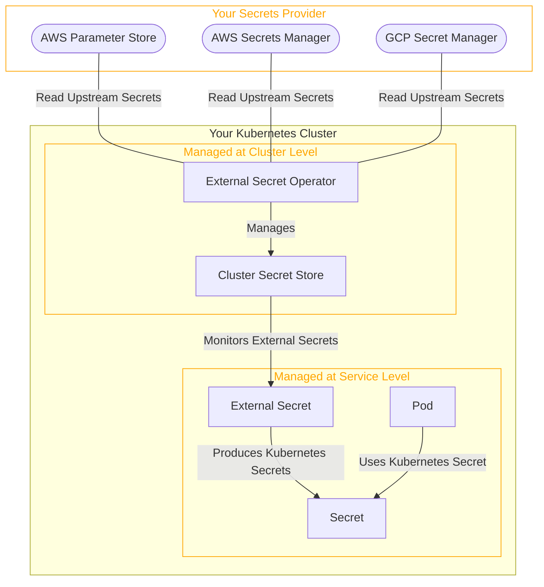

import ReferenceExternalSecrets from '/snippets/secret-manager-access/reference-external-secrets.mdx';

<Info>
  This feature is available on:
  * AWS Managed Cluster
  * GCP Managed Cluster

  Supported Secrets Providers:
  * AWS Secrets Manager
  * AWS Parameter Store
  * GCP Secret Manager
</Info>

## Secret Manager Access benefits

Compared to Qovery built-in secrets, integrating a dedicated Secret Manager offers several key advantages:

- **Security and data sovereignty**: Your secrets stay entirely within your own infrastructure and are never transmitted through Qovery's systems.
 Secret values are fetched directly by External Secret Operator from your provider into your cluster, minimizing the number of systems that ever handle
 raw secret values. With built-in secrets, the value passes through Qovery's API and storage layer.

- **Centralized secret management**: Use your existing secrets provider as a single source of truth across all your infrastructure —
Qovery services, Lambda functions, CI pipelines, and other tools all reference the same secrets without duplication.
A secret defined once can also be consumed by multiple clusters (e.g., staging and production) without recreating it in each environment.

- **Simplified and automatic secret rotation**: When a shared secret needs updating, change it once in your secrets manager, then redeploy
the affected services via Qovery to pick up the new value. You can also leverage native automatic rotation from your provider (e.g., database credentials
rotated via a Lambda function) — Qovery services will benefit from it in the next deployment without any additional secret management step.

- **Audit trails and compliance**: Cloud-native secret managers provide built-in versioning, access logs, and fine-grained IAM policies —
seamlessly extending your existing compliance posture to secrets consumed by Qovery services.

## How it works

Qovery integrates with external secrets by deploying [ESO](https://external-secrets.io/latest/) (External Secrets Operator) in your cluster.

## Configure a Secret Manager Access

You can configure a Secret Manager Access in the **Add-ons** section of your cluster.

<Frame>
  
</Frame>

<Warning>
  Creating or Editing a Secret Manager Access **requires the cluster to be redeployed**
</Warning>

Select the guide for your secrets provider:

<CardGroup cols={3}>
  <Card title="AWS Secrets Manager" icon="aws" href="/configuration/integrations/secret-managers/aws-secrets-manager">
    Connect to AWS Secrets Manager from an AWS or GCP cluster
  </Card>
  <Card title="AWS Parameter Store" icon="aws" href="/configuration/integrations/secret-managers/aws-parameter-store">
    Connect to AWS Parameter Store from an AWS or GCP cluster
  </Card>
  <Card title="GCP Secret Manager" icon="google" href="/configuration/integrations/secret-managers/gcp-secret-manager">
    Connect to GCP Secret Manager from a GCP or AWS cluster
  </Card>
</CardGroup>

<ReferenceExternalSecrets />
