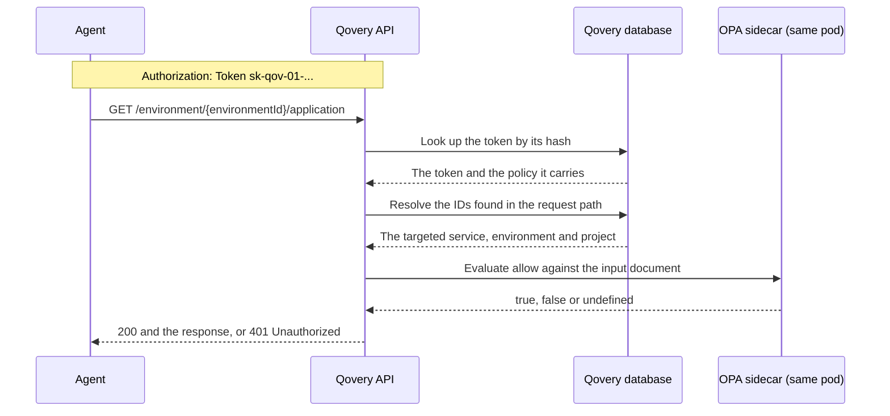

An **API Policy Token** is a second kind of organization token, intended for autonomous agents and narrowly scoped automation. Unlike a regular [API Token](/configuration/organization/api-token), it carries **no role**. Instead you attach an [Open Policy Agent](https://www.openpolicyagent.org/) policy, written in [rego](https://www.openpolicyagent.org/docs/policy-language), and Qovery evaluates that policy against every API request the token makes. The policy is the token's entire authorization.

<Info>
  **Beta**: this feature and the policy input contract described below are still
  evolving and are likely to change. Expect to revisit your policies as the
  feature matures.
</Info>

<Note>
  In the Qovery Console, this feature is labelled **Policy API Token (Beta)**,
  in the **Token API** section of your organization settings.
</Note>

## Why use one

A role answers "what kind of thing may this token do, across a scope". A policy answers "may *this exact request* proceed". That is what makes it a fit for an agent: you can hand out a token that reads everything in one environment, deploys that environment, may update one service, and can never delete anything - a shape no role expresses.

|                             | API Token                                              | API Policy Token                                                       |
| --------------------------- | ------------------------------------------------------ | ---------------------------------------------------------------------- |
| Authorization               | An [RBAC role](/configuration/organization/members-rbac) | A rego policy, evaluated on every request                              |
| Granularity                 | What the role allows                                   | Any condition over the HTTP request and the resource it targets        |
| Who can create it           | Depends on your role                                   | Organization **Owner** or **Admin** only                               |
| Editable after creation     | No                                                     | No                                                                     |
| Typical use                 | CI/CD, Terraform, scripts                              | AI agents, tightly scoped automation                                   |

## How it works

### What Open Policy Agent does

[Open Policy Agent](https://www.openpolicyagent.org/) (OPA) is an open source, general-purpose policy engine and a [CNCF graduated project](https://www.cncf.io/projects/open-policy-agent-opa/). Its model is deliberately narrow: it knows nothing about Qovery and holds no permission model of its own. You give it two things - a policy, and a JSON document called the **input** - and it answers a query against them. That is all it does.

That separation is the point. The rules deciding what your agent may do live in the policy rather than in Qovery's permission code, so you can express a constraint Qovery never anticipated without Qovery having to invent a role for it.

Qovery runs OPA as a sidecar next to the API, reachable only over the pod's loopback interface. Your policy and the requests it is evaluated against never leave Qovery's infrastructure, and a decision costs an in-pod round trip rather than a call out to a network service.

### How Qovery evaluates a request

The policy is evaluated at authentication time, before the request reaches the endpoint it targets. That is also why the policy sees the request's raw path rather than a route template - the route has not been matched yet.



1. **The token is recognised** by its `sk-qov-01` prefix in the `Authorization` header, which is what tells it apart from a regular API token sent under the same `Token` scheme.
2. **The token is looked up.** Only a hash of the token value is stored, so the presented value is hashed and matched against it. An unknown or expired token stops here.
3. **The target is resolved.** Qovery takes the IDs appearing in the request path and asks its own database what they are - a service, an environment, a project - and what that resource's ancestry is. This is what fills `qovery_metadata`, and it is why a policy can talk about environments while the request only names a service.
4. **The input document is built** from the request and that resolved metadata. Its exact shape is [documented below](#what-the-policy-sees).
5. **The policy is loaded.** The first time a pod handles a given token, it uploads that token's policy to its OPA sidecar as a module, under a package unique to the token. Per-token packages are what stop one token's rules from ever contributing to another token's decision, and they are the reason your policy must not declare a `package` of its own. The module is compiled once and reused for subsequent requests.
6. **The policy is evaluated** against the input, and OPA returns the value of `allow`: `true`, `false`, or undefined when no rule produced a value.
7. **The decision is applied.** `true` lets the request continue to the endpoint. Anything else - including undefined, a non-boolean value, or an OPA that could not be reached - answers `401 Unauthorized`.

### Rego, the policy language

Policies are written in [rego](https://www.openpolicyagent.org/docs/policy-language), OPA's language. It is declarative and derives from [Datalog](https://en.wikipedia.org/wiki/Datalog), extended to query nested JSON documents - which is exactly what an `input` document is. There are no statements to sequence and no control flow to trace: you declare the conditions under which something holds, and OPA searches for a way to satisfy them.

Five ideas carry almost every Qovery policy.

**A rule has a head and a body, and the body is an AND.** Every expression in the body must hold for the rule to produce its value.

```rego
# Reads as: allow, if the method is GET and the environment is that one.
allow if {
	input.request.method == "GET"
	input.qovery_metadata.environment_id == "4a9dc488-df2b-4544-9c5f-4eb0428fda49"
}
```

**Rules sharing a name are an OR.** Defining `allow` twice is not a conflict, it adds an alternative. This is how a policy grants several unrelated things without collapsing into one tangled condition:

```rego
default allow := false

allow if read_only_access
allow if deploy_access

# The two alternatives, each a rule of its own.
read_only_access if input.request.method in {"GET", "HEAD"}

deploy_access if input.request.path == ["api", "application", "5bf547f9-b445-44bc-aab8-7f341187d362", "deploy"]
```

**Anything missing is undefined, not an error.** An expression referring to a value that is not there is itself undefined, and that propagates: the surrounding rule simply does not fire. `input.request.body.key` on a request that carried no body is undefined, so the rule using it does not fire, so the request is denied. Nothing throws, and fail-closed comes out as the natural default rather than something bolted on.

**`default` supplies a value when nothing fires.** Without it, a request matching no rule leaves `allow` undefined; with it, the answer is explicitly `false`.

```rego
default allow := false
```

**`:=` assigns, `==` compares, `in` tests membership.** Membership needs no loop, which keeps a list of allowed verbs readable:

```rego
allowed_environment_id := "4a9dc488-df2b-4544-9c5f-4eb0428fda49"

allow if {
	input.request.method in {"GET", "HEAD"}
	input.qovery_metadata.environment_id == allowed_environment_id
}
```

Rego also ships a large standard library - `startswith`, `endswith`, `count`, `regex.match`, `sprintf` and many more - listed in the [policy reference](https://www.openpolicyagent.org/docs/policy-reference).

<Tip>
  The [Rego Playground](https://play.openpolicyagent.org/) evaluates a policy
  against an input document in your browser, which is a fast way to get a feel
  for the language before writing a real policy. Paste one of the
  [recipes](#policy-recipes) and an `input` document from this page into it.
</Tip>

### What this means in practice

- **The policy is the only thing constraining the token.** Internally a policy token is granted organization-admin access, and the policy is what narrows it. A policy whose `allow` is unconditionally `true` therefore grants **full organization-admin access**.
- **It fails closed.** Anything other than an explicit `true` denies the request: no matching rule, a non-boolean `allow`, a request path that Qovery cannot resolve, or a policy engine that cannot be reached.
- **Only an organization Owner or Admin can create one.** Creating a policy token is equivalent to handing out organization-admin access, so it is restricted to roles that already hold it. Custom roles cannot create one.
- **Revocation is immediate.** The token is looked up on every request, with no caching.
- **Actions are attributed in the audit log** as `policy:<token-id>:<token-name>`, so an agent's activity is distinguishable from a regular API token's.

<Warning>
  Treat creating an API Policy Token with the same care as granting
  organization-admin. Start from a `default allow := false` policy and add only
  the rules you need.
</Warning>

## What the policy sees

Your policy is evaluated against this `input` document:

```json
{
  "request": {
    "method": "POST",
    "path": ["api", "environment", "4a9dc488-df2b-4544-9c5f-4eb0428fda49", "service", "deploy"],
    "body": { "force": true }
  },
  "qovery_metadata": {
    "organization_id": "a3c8f0d2-1b44-4e9a-9c31-6f5d2e8a7b10",
    "service_id": null,
    "service_type": null,
    "environment_id": "4a9dc488-df2b-4544-9c5f-4eb0428fda49",
    "project_id": "c47d1e83-9a06-4f52-8d7b-2e1a94c6f5b3",
    "cluster_id": "9f1c2b3d-4e5a-6b7c-8d9e-0f1a2b3c4d5e"
  },
  "token": {
    "id": "0198f2a1-6c3d-7b41-9e08-5a2d3c4b7e91",
    "name": "deploy-agent"
  }
}
```

| Field                                | Description                                                                                                                                                                       |
| ------------------------------------ | --------------------------------------------------------------------------------------------------------------------------------------------------------------------------------- |
| `input.request.method`               | The HTTP verb, uppercase.                                                                                                                                                         |
| `input.request.path`                 | The path segments of the request, decoded. These are the real segments with real IDs, not a route template.                                                                        |
| `input.request.body`                 | The parsed JSON body, or `null` when the request carries none (the normal case for `GET` and `DELETE`).                                                                            |
| `input.qovery_metadata.organization_id` | The organization the token belongs to.                                                                                                                                         |
| `input.qovery_metadata.service_id`   | The service the request targets, or `null`.                                                                                                                                       |
| `input.qovery_metadata.service_type` | `APPLICATION`, `CONTAINER`, `DATABASE`, `ROUTER`, `JOB`, `HELM`, `TERRAFORM`, `ARGOCD_APP`, `AGENTIC_WORKFLOW`, or `null`.                                                         |
| `input.qovery_metadata.environment_id` | The environment the request targets, or `null`.                                                                                                                                  |
| `input.qovery_metadata.project_id`   | The project the request targets, or `null`.                                                                                                                                       |
| `input.qovery_metadata.cluster_id`   | The cluster the targeted resource runs on, or `null`.                                                                                                                             |
| `input.token.id`, `input.token.name` | The token making the request.                                                                                                                                                     |

<Note>
  The public API path is internally prefixed with `api`, so
  `POST https://api.qovery.com/environment/<id>/service/deploy` reaches your
  policy as `["api", "environment", "<id>", "service", "deploy"]`. Include that
  first segment when you match on a path.
</Note>

A few behaviours worth knowing before you write rules against these fields:

- **The `qovery_metadata` keys are always present**, set to `null` when nothing of that kind was resolved. Test `input.qovery_metadata.service_id == null`, not the absence of the key.
- **Qovery resolves one target per request**, preferring a service over an environment over a project. For `/api/environment/<env>/application/<app>`, the target is the application: `environment_id`, `project_id` and `cluster_id` are then read from *that service's* ancestry rather than from the path. So a rule on `environment_id` still holds for a request that only names the service.
- **IDs belonging to another organization are ignored**, as if they were not in the path.
- **A request whose path cannot be resolved is denied**, rather than shown with `null` fields. A rule phrased as `service_id != "<id>"` cannot be widened by a failed lookup.
- **Only JSON bodies are forwarded.** A request with a non-JSON body, a malformed JSON body, or a body larger than 1 MiB is denied outright rather than presented to the policy with `body` set to `null`. Inside a policy, `body == null` therefore always means "there was no body".
- **Query parameters, headers and the client IP are deliberately not exposed.**

## Writing the policy

<Warning>
  Do not include a `package` declaration. Qovery prepends a per-token package so
  that one token's rules can never authorize another's, and a submitted
  `package` line is rejected. Submit rule definitions only.
</Warning>

- The policy **must define an `allow` rule**, and the decision must be the boolean `true`. Anything else denies.
- Start with `default allow := false`. Without it, a request that matches no rule leaves `allow` undefined, which Qovery also treats as a denial - the default just makes the intent explicit.
- Maximum policy size: 65,536 characters.
- The policy is compiled when you create the token, so a syntax error comes back immediately as a `400` with the compiler diagnostics.
- The engine is OPA 1.19, so rego v1 syntax is available directly: `if`, `in` and `contains` need no `import` statement.

## Starter policy

This is the policy prefilled in the Console when you create a token. It grants read-only access to one environment, write access to one service in it (but never a deletion), and the right to deploy that environment.

```rego
default allow := false

allowed_environment_id := "4a9dc488-df2b-4544-9c5f-4eb0428fda49"
allowed_application_id := "5bf547f9-b445-44bc-aab8-7f341187d362"

allow if read_only_access_on_env
allow if modify_only_allowed_service
allow if allow_deployment

# Read-only access to every endpoint that touches this environment.
read_only_access_on_env if {
	input.request.method in {"GET", "HEAD"}
	input.qovery_metadata.environment_id == allowed_environment_id
}

# Write access only when the request targets this service, and never a deletion.
modify_only_allowed_service if {
	input.request.method != "DELETE"
	input.qovery_metadata.service_id == allowed_application_id
}

# Deploy this environment.
allow_deployment if {
	input.request.path == ["api", "environment", allowed_environment_id, "service", "deploy"]
}
```

## Policy recipes

<AccordionGroup>
  <Accordion title="Read-only access to one environment">
    Every `GET` and `HEAD` on the environment, its services and their sub-resources. Nothing else.

    ```rego
    default allow := false

    allowed_environment_id := "4a9dc488-df2b-4544-9c5f-4eb0428fda49"

    allow if {
    	input.request.method in {"GET", "HEAD"}
    	input.qovery_metadata.environment_id == allowed_environment_id
    }
    ```

  </Accordion>

  <Accordion title="Deploy, and nothing else">
    A token for a release pipeline: it can trigger deployments and cannot read or change anything else. Matching on the exact path is what keeps it that narrow.

    ```rego
    default allow := false

    allowed_environment_id := "4a9dc488-df2b-4544-9c5f-4eb0428fda49"
    allowed_application_id := "5bf547f9-b445-44bc-aab8-7f341187d362"

    # Deploy every service of that environment.
    allow if input.request.path == ["api", "environment", allowed_environment_id, "service", "deploy"]

    # Deploy that one application.
    allow if input.request.path == ["api", "application", allowed_application_id, "deploy"]
    ```

  </Accordion>

  <Accordion title="Change one service, but never delete it">
    Full read and write on a single service, with deletion excluded whatever the endpoint.

    ```rego
    default allow := false

    allowed_application_id := "5bf547f9-b445-44bc-aab8-7f341187d362"

    allow if {
    	input.request.method != "DELETE"
    	input.qovery_metadata.service_id == allowed_application_id
    }
    ```

  </Accordion>

  <Accordion title="Constrain the request body">
    Because the parsed JSON body is part of the input, a rule can constrain the content of a change and not just its target. Here the agent may create environment variables on one application, but only those named `FEATURE_*`.

    ```rego
    default allow := false

    allowed_application_id := "5bf547f9-b445-44bc-aab8-7f341187d362"

    allow if {
    	input.request.method == "POST"
    	input.request.path == ["api", "application", allowed_application_id, "environmentVariable"]
    	startswith(input.request.body.key, "FEATURE_")
    }
    ```

    A request with no body leaves `input.request.body.key` undefined, so this rule denies it.

  </Accordion>
</AccordionGroup>

## Create an API Policy Token

<Steps>
  <Step title="Open the Token API section">
    Go to your organization settings and open the **Token API** section, the same
    page as the [API tokens](/configuration/organization/api-token). The
    **Policy API Token (Beta)** section sits below the API token list.
  </Step>

  <Step title="Click Add new">
    Press the **Add new** button of the Policy API Token section.
  </Step>

  <Step title="Configure the token">
    Provide:

    - **Token name**: a descriptive name, unique within the organization
    - **Description**: what the token is for
    - **Policy (rego)**: your policy, prefilled with the starter policy above

  </Step>

  <Step title="Store the token value">
    The token is displayed once, in the form `sk-qov-01-...`. Copy it before
    closing the modal.
  </Step>
</Steps>

<Warning>
  **Important**: Make sure you safely store the token returned by the UI. You
  won't be able to retrieve it again (you will have to create a new one).
</Warning>

## Use the token

An API Policy Token uses the same `Authorization` header scheme as a regular API token:

```bash
export QOVERY_POLICY_TOKEN="sk-qov-01-..."

curl -X GET "https://api.qovery.com/environment/<environmentId>/application" \
  -H "Authorization: Token ${QOVERY_POLICY_TOKEN}" \
  -H "Content-Type: application/json"
```

If the policy does not allow the request, the API answers `401 Unauthorized`.

## Inspect and revoke

In the Policy API Token list, each token offers:

- **Inspect policy** (scroll icon): shows the policy attached to the token, read-only. A policy can always be reviewed after creation - only the token value is write-once.
- **Delete** (trash icon): revokes the token. Confirm the deletion, and the token stops working immediately.

Policies cannot be edited. To change one, delete the token and create a new one with the updated policy.

## Manage tokens via the API

| Operation | Endpoint |
| --------- | -------- |
| Create | `POST /organization/{organizationId}/policyApiToken` |
| List | `GET /organization/{organizationId}/policyApiToken` |
| Revoke | `DELETE /organization/{organizationId}/policyApiToken/{policyApiTokenId}` |

Creating a token, with the policy passed as a string in `opa_policy`:

```bash
curl -X POST "https://api.qovery.com/organization/${ORGANIZATION_ID}/policyApiToken" \
  -H "Authorization: Token ${QOVERY_API_TOKEN}" \
  -H "Content-Type: application/json" \
  -d '{
    "name": "deploy-agent",
    "description": "Deploys the staging environment",
    "opa_policy": "default allow := false\n\nallow if input.request.path == [\"api\", \"environment\", \"4a9dc488-df2b-4544-9c5f-4eb0428fda49\", \"service\", \"deploy\"]\n"
  }'
```

The response contains the token value in its `token` field. This is the only response that ever carries it.

The list endpoint returns each token with its `opa_policy`, never the token value. The create endpoint also accepts an optional `expires_at` (RFC 3339 date-time), after which the token stops authenticating; the Console form does not expose it yet, so set an expiration through the API if you need one.

Errors to expect when creating a token:

| Status | Cause |
| ------ | ----- |
| `400` | The policy is empty, oversized, declares a `package`, or does not compile. The response carries the OPA diagnostics. |
| `403` | The caller is not an organization owner or admin. |
| `409` | A policy token with that name already exists in the organization. |

## Test a policy before attaching it

A denied request tells you only that it was denied, so it is worth evaluating a policy locally first. Install [OPA](https://www.openpolicyagent.org/docs) 1.19 - the same version Qovery runs - then:

<Steps>
  <Step title="Save the policy with a temporary package line">
    Qovery adds the `package` declaration for you, so add one locally and remove
    it before submitting.

    ```rego
    # policy.rego
    package qovery.policy

    default allow := false

    allowed_environment_id := "4a9dc488-df2b-4544-9c5f-4eb0428fda49"

    allow if {
    	input.request.method in {"GET", "HEAD"}
    	input.qovery_metadata.environment_id == allowed_environment_id
    }
    ```

  </Step>

  <Step title="Save the request you want to test">
    Write an `input.json` following the [input document](#what-the-policy-sees)
    shown above.
  </Step>

  <Step title="Evaluate">
    ```bash
    opa check policy.rego
    opa eval -d policy.rego -i input.json --format raw 'data.qovery.policy.allow'
    ```

    `true` means the request would be allowed. `false`, or an empty result, means
    it would be denied.

  </Step>
</Steps>

<Tip>
  Test the denials too, not just the allows. Flip the method to `DELETE`, point
  the request at another environment, and confirm the answer is `false`.
</Tip>

## Beta limitations

<Warning>
  - **A denied request returns `401` with no explanation.** Which rule failed is not surfaced to you today, so test policies locally before attaching them.
  - **Policies cannot be edited.** Delete the token and create a new one.
  - **Expiration is API-only.** The Console form does not expose `expires_at`.
  - **The input contract may change.** Fields are added rather than renamed or removed, but the feature as a whole is Beta.
</Warning>

## Related

<CardGroup cols={2}>
  <Card title="API Token" icon="key" href="/configuration/organization/api-token">
    Role-based tokens for CI/CD, Terraform and scripts.
  </Card>
  <Card title="Securing AI Agent Access" icon="shield-halved" href="/copilot/securing-ai-access">
    The full picture on giving an AI agent a safe footprint on your infrastructure.
  </Card>
  <Card title="Members & RBAC" icon="users" href="/configuration/organization/members-rbac">
    The roles that back regular API tokens.
  </Card>
</CardGroup>
