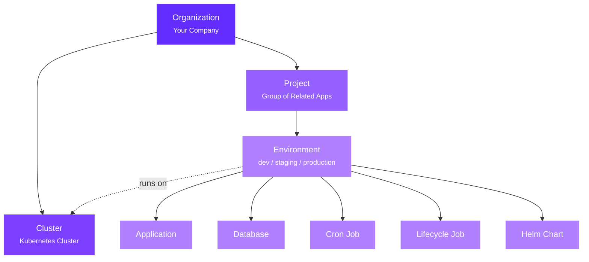

## Quick Overview

Qovery organizes your infrastructure in a simple hierarchy:



Let's break down each level.

---

## Organization

Your **Organization** is your company's workspace: the top-level container for everything in Qovery.

**Key features:**
- Team collaboration across multiple projects
- Role-based access control ([RBAC](/configuration/organization/members-rbac))
- Shared cloud credentials and integrations
- Billing and cost management

<Tip>
Most companies have one Organization. Users can belong to multiple Organizations with different roles.
</Tip>

---

## Cluster

A **Cluster** is a Kubernetes cluster where your services run: a collection of machines (nodes) that execute containerized applications.

**Two types of clusters:**

<Tabs>
  <Tab title="Managed by Qovery">
    Qovery provisions and manages the entire cluster lifecycle:
    - Automatic setup and configuration
    - Upgrades and security patches
    - Monitoring and maintenance
    - Auto-scaling with Karpenter (AWS)

    **Supported providers:** AWS (EKS), GCP (GKE), Azure (AKS), Scaleway (Kapsule)

    [Create a managed cluster →](/getting-started/quickstart/cloud)
  </Tab>

  <Tab title="Self-Managed (BYOK)">
    You manage the cluster, Qovery provides the developer experience:
    - Use your existing Kubernetes cluster
    - Complete control over configuration
    - Any cloud provider or on-premise
    - Custom security and networking

    **Supported:** Any Kubernetes 1.24+ cluster

    [Connect your cluster →](/configuration/integrations/kubernetes/byok)
  </Tab>
</Tabs>

[Learn more about Clusters →](/configuration/clusters)

---

## Project

A **Project** groups related services that work together for a common purpose.

**Examples:**
- Main Application (frontend + backend + database)
- Internal Tools
- Marketing Website

**Structure:**
```
Project: "E-commerce Platform"
├── Production Environment
├── Staging Environment
└── Development Environment
```

[Learn more about Projects →](/configuration/project)

---

## Environment

An **Environment** is a deployment stage containing services at a specific version (usually tied to a Git branch).

**Common types:**
- **Production** - Live applications (`main` branch)
- **Staging** - Pre-production testing (`staging` branch)
- **Development** - Feature development (`develop` branch)
- **Preview** - Temporary per-pull-request environments

<Info>
**Preview Environments** are automatically created for each pull request and deleted when merged. Perfect for testing changes in isolation before production. [Learn more →](/getting-started/guides/use-cases/ephemeral-environment)
</Info>

[Learn more about Environments →](/configuration/environment)

---

## Services

**Services** are the building blocks of your environment: applications, databases, jobs, and more.

<CardGroup cols={2}>
  <Card title="Application" icon="window">
    Your containerized apps built from Git or container registries.

    **Features:**
    - Auto-scaling
    - Custom domains + HTTPS
    - Health checks
    - Rolling deployments

    [Configuration →](/configuration/application)
  </Card>

  <Card title="Database" icon="database">
    Managed databases or containerized instances.

    **Supported:**
    - PostgreSQL, MySQL
    - MongoDB, Redis

    **Modes:**
    - Container (dev/test)
    - Managed (production)

    [Configuration →](/configuration/database)
  </Card>

  <Card title="Cron Job" icon="clock">
    Scheduled tasks on a cron schedule.

    **Use cases:**
    - Data processing
    - Backups
    - Report generation

    [Configuration →](/configuration/cronjob)
  </Card>

  <Card title="Lifecycle Job" icon="bolt">
    One-time jobs triggered by events (deploy/stop/delete).

    **Use cases:**
    - Database seeding
    - Pre-deployment checks
    - Environment cleanup

    [Configuration →](/configuration/lifecycle-job)
  </Card>

  <Card title="Helm Chart" icon="/images/logos/helm-icon.svg">
    Deploy packaged Helm applications.

    **Examples:**
    - Prometheus
    - Grafana
    - Message queues

    [Configuration →](/configuration/helm)
  </Card>

  <Card title="Terraform" icon="/images/logos/terraform-icon.svg">
    Deploy any infrastructure via Terraform.

    **Use cases:**
    - AWS RDS, S3
    - Serverless functions
    - Custom cloud resources

    [Configuration →](/configuration/terraform)
  </Card>
</CardGroup>

---

## Deployment

**Deployment** is the operational process that takes your code from Git and makes it run on Kubernetes.

**What happens during deployment:**

<Steps>
  <Step title="Code Retrieval">
    Qovery fetches your code from Git (GitHub, GitLab, Bitbucket) based on the branch configured for your environment
  </Step>

  <Step title="Build">
    Your code is built into a container image using Docker. Qovery auto-detects your framework or uses your Dockerfile
  </Step>

  <Step title="Push to Registry">
    The container image is pushed to a registry (AWS ECR, Docker Hub, GCP Artifact Registry, etc.)
  </Step>

  <Step title="Deploy to Kubernetes">
    Qovery provisions all necessary Kubernetes resources (pods, services, ingress, secrets) and deploys your application
  </Step>

  <Step title="Health Checks">
    Qovery monitors your application health and reports deployment status
  </Step>
</Steps>

**Deployment features:**
- **GitOps automation** - Auto-deploy on every Git push
- **Preview environments** - Auto-deploy pull requests
- **Zero downtime** - Rolling updates with health checks
- **Rollback** - One-click rollback to any previous version
- **Pipeline stages** - Databases → Jobs → Containers → Applications

**Monitor deployments:**
- Real-time deployment logs
- Service logs (stdout/stderr)
- Deployment history with status tracking

[Learn more about Deployments →](/configuration/deployment/overview)

---

## Key Features

### Environment Variables

Configure apps with variables at three levels:

- **Project level** - Shared across all environments
- **Environment level** - Shared across services in one environment
- **Service level** - Specific to one service

Qovery auto-generates connection variables:
```bash
QOVERY_DATABASE_MY_DB_HOST
QOVERY_DATABASE_MY_DB_PORT
QOVERY_DATABASE_MY_DB_CONNECTION_URI
```

[Learn more →](/configuration/environment-variables)

### Networking

- **Internal**: Services communicate privately within an environment
- **Public**: Expose apps with auto-generated domains (`*.qovery.io`) or custom domains
- **HTTPS**: Automatic SSL/TLS certificates

---

## Next Steps

<CardGroup cols={2}>
  <Card title="Quick Start" icon="rocket" href="/getting-started/quickstart">
    Deploy your first app in 15 minutes
  </Card>
  <Card title="How Qovery Works" icon="gears" href="/getting-started/how-it-works">
    Understand the architecture
  </Card>
  <Card title="Configuration Guide" icon="sliders" href="/configuration/overview">
    Explore all configuration options
  </Card>
  <Card title="Deployment Guide" icon="rocket" href="/configuration/deployment/overview">
    Learn about deployment workflows
  </Card>
</CardGroup>
