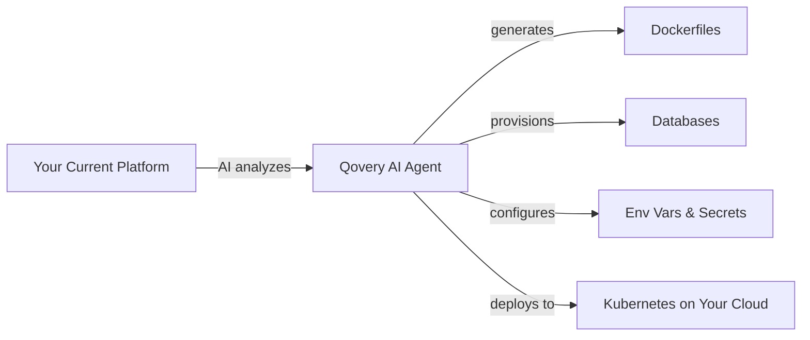

## Overview

Migrating to Kubernetes is traditionally the hardest part of modernizing your infrastructure. It means months of planning, rewriting deployment configs, learning Helm charts, and re-architecting your stack. Most teams get stuck halfway.

Qovery removes that complexity entirely. With Qovery AI skills, you can migrate your applications from any platform - Heroku, Render, OpenShift, legacy VMs - to Kubernetes running on **your own cloud account** (AWS, GCP, Azure, or Scaleway). The AI agent analyzes your codebase, generates Dockerfiles, provisions databases, sets up environment variables, and deploys everything. No Kubernetes expertise required.

<Info>
For complex migrations (microservices architectures, stateful workloads, compliance requirements), Qovery provides **cloud architect assistance**. [Book a demo](https://www.qovery.com/book-a-demo) to get a personalized migration plan.
</Info>

## Why Migrate with Qovery?

<CardGroup cols={3}>
  <Card title="AI-Powered Migration" icon="wand-magic-sparkles">
    The `/qovery-deploy` AI skill analyzes your codebase, creates Dockerfiles, provisions databases, and deploys - all from a single prompt
  </Card>

  <Card title="No Kubernetes Expertise" icon="graduation-cap">
    Qovery abstracts the complexity of Kubernetes. You deploy applications - Qovery handles pods, ingress, TLS, RBAC, and networking
  </Card>

  <Card title="Your Cloud, Your Control" icon="cloud">
    Everything runs on your own AWS, GCP, Azure, or Scaleway account. No vendor lock-in, no shared infrastructure
  </Card>

  <Card title="Cloud Architect Assistance" icon="headset">
    Qovery's team helps with complex migrations. [Book a demo](https://www.qovery.com/book-a-demo) to get a personalized migration plan
  </Card>

  <Card title="Compliance Ready" icon="shield-check">
    SOC2 Type II, ISO 27001, DORA, HIPAA, GDPR compliant infrastructure from day one
  </Card>

  <Card title="Cost Savings" icon="dollar-sign">
    Right-sized from the start. No over-provisioning, no surprise bills. Customers report $200K+ annual savings vs. DIY Kubernetes
  </Card>
</CardGroup>

## Migrate from Any Platform

<CardGroup cols={3}>
  <Card title="Heroku" icon="h">
    Dynos, add-ons, Heroku Postgres, Redis - all mapped to Kubernetes equivalents automatically
  </Card>

  <Card title="Render" icon="server">
    Web services, background workers, cron jobs, managed databases - migrated with full parity
  </Card>

  <Card title="OpenShift" icon="redhat">
    DeploymentConfigs, Routes, BuildConfigs - converted to standard Kubernetes resources
  </Card>

  <Card title="VMs / Bare Metal" icon="hard-drive">
    Legacy applications running on EC2, DigitalOcean droplets, or bare metal servers
  </Card>

  <Card title="Docker Compose" icon="docker">
    Multi-container setups defined in docker-compose.yml - each service becomes a Qovery application
  </Card>

  <Card title="Other PaaS" icon="cloud-arrow-up">
    Fly.io, Railway, DigitalOcean App Platform, Google App Engine, Azure App Service, and more
  </Card>
</CardGroup>

## How It Works



1. **Install** the Qovery AI skill (one command)
2. **Ask** the AI agent to migrate your project
3. **AI analyzes** your codebase - detects languages, frameworks, databases, dependencies
4. **AI generates** optimized Dockerfiles if missing
5. **AI provisions** databases (PostgreSQL, Redis, MongoDB, MySQL) and configures environment variables
6. **AI deploys** everything to Kubernetes on your cloud provider
7. **You verify** and go live

## Getting Started

### Option 1: AI-Powered Migration (Recommended)

The fastest path. The AI agent handles the entire migration end-to-end.

<Steps>
  <Step title="Install the Qovery AI Skill">
    One command installs the skill globally for all your projects:

    ```bash
    curl -fsSL https://skill.qovery.com/install.sh | bash
    ```
  </Step>

  <Step title="Open Your AI Coding Tool">
    Launch [OpenCode](https://opencode.ai), Claude Code, Cursor, VS Code Copilot, or any compatible AI coding tool.
  </Step>

  <Step title="Ask the Agent to Migrate">
    ```
    Migrate my project from Heroku to Kubernetes with Qovery
    ```

    Or use the skill command directly:

    ```
    /qovery-deploy
    ```

    The agent will guide you through the entire process:

    - **Analyze** your codebase and detect languages, frameworks, and databases
    - **Create** optimized multi-stage Dockerfiles if your project doesn't have one
    - **Provision** databases (PostgreSQL, Redis, MongoDB, MySQL) - managed or containerized
    - **Set up** environment variables and secrets
    - **Deploy** everything to Kubernetes on your cloud provider
    - **Watch** the deployment and auto-fix any issues (up to 3 retries per service)

    <Tip>
    The AI agent supports Node.js, Python, Go, Java, Ruby, PHP, .NET, React, Vite, Next.js, Rails, Django, Spring, Laravel, and many more frameworks.
    </Tip>
  </Step>

  <Step title="Migrate Environment Variables">
    The AI agent handles environment variable migration as part of the deployment process.

    For **Heroku** specifically, you can also export and import manually using the Qovery CLI:

    ```bash
    qovery auth
    qovery context set
    heroku config --app <your_heroku_app_name> --json | \
      qovery env parse --heroku-json > heroku.env && \
      qovery env import heroku.env && \
      rm heroku.env
    ```

    <Warning>
    Import sensitive data (API keys, credentials, tokens) as **Secrets**, not Environment Variables.
    </Warning>
  </Step>

  <Step title="Verify and Go Live">
    Once the deployment is complete:

    1. Check your application status in the [Qovery Console](https://console.qovery.com)
    2. Test your endpoints using the auto-generated Qovery URL
    3. [Configure your custom domain](/configuration/application#domains) when ready
    4. Update your DNS records to point to Qovery
  </Step>
</Steps>

### Option 2: Manual Migration

For teams that prefer full control over every step.

<Steps>
  <Step title="Create Your Dockerfile">
    If your project doesn't have a Dockerfile, create one. Qovery provides templates for all major frameworks.

    Example for a Node.js application:

    ```dockerfile
    FROM node:20-alpine AS builder
    WORKDIR /app
    COPY package*.json ./
    RUN npm ci
    COPY . .
    RUN npm run build

    FROM node:20-alpine
    WORKDIR /app
    COPY --from=builder /app/dist ./dist
    COPY --from=builder /app/node_modules ./node_modules
    EXPOSE 3000
    CMD ["node", "dist/index.js"]
    ```

    <Tip>
    Use multi-stage builds to keep your images small and secure. The AI agent generates these automatically when you use Option 1.
    </Tip>
  </Step>

  <Step title="Create Resources on Qovery">
    1. Sign in to the [Qovery Console](https://console.qovery.com)
    2. Create your Organization and Project
    3. Create your production Environment
    4. Add your application (select your Git repository, branch, and port)
    5. Add your database (PostgreSQL, MySQL, MongoDB, or Redis - managed or containerized)
  </Step>

  <Step title="Configure Environment Variables">
    1. Export your environment variables from your current platform
    2. Import them into Qovery via the Console or [CLI](/cli/commands/env)
    3. Create environment variable aliases to connect your services (e.g., link your app to your database using `DATABASE_URL`)
  </Step>

  <Step title="Deploy">
    Click "Deploy" in the Qovery Console or use the CLI:

    ```bash
    qovery deploy
    ```
  </Step>
</Steps>

### Need Help? Talk to a Cloud Architect

<CardGroup cols={1}>
  <Card title="Book a Migration Demo" icon="calendar" href="https://www.qovery.com/book-a-demo">
    For complex migrations - microservices, stateful workloads, compliance requirements, or large-scale infrastructure - Qovery provides personalized cloud architect assistance. Get a migration plan tailored to your stack.
  </Card>
</CardGroup>

## What Gets Migrated?

| Source | Qovery Equivalent | Handled by AI? |
|--------|-------------------|----------------|
| Web applications (any language/framework) | [Applications](/configuration/application) - containerized on Kubernetes | Yes |
| Background workers (Sidekiq, Celery, etc.) | [Applications](/configuration/application) - separate services | Yes |
| Cron jobs | [Cron Jobs](/configuration/cronjob) | Yes |
| PostgreSQL, MySQL | [Managed Database](/configuration/database) (AWS RDS, GCP Cloud SQL, etc.) | Yes |
| Redis, MongoDB | [Container Database](/configuration/database) or Managed | Yes |
| Environment variables | [Environment Variables & Secrets](/configuration/environment-variable) | Yes |
| Custom domains | [Custom Domains](/configuration/application#domains) | Manual DNS update required |
| Add-ons (Memcached, Elasticsearch, etc.) | [Helm Charts](/configuration/helm) or container services | Partially |
| Scheduled tasks | [Lifecycle Jobs](/configuration/lifecycle-job) | Yes |

## FAQ

<AccordionGroup>
  <Accordion title="How long does migration take?">
    For most applications, less than a day. The AI agent handles Dockerfile creation, database provisioning, environment variable setup, and deployment in minutes. Complex multi-service architectures may take longer - [book a demo](https://www.qovery.com/book-a-demo) for a personalized timeline.
  </Accordion>

  <Accordion title="Do I need Kubernetes expertise?">
    No. Qovery abstracts all Kubernetes complexity. You interact with applications, databases, and environment variables - not pods, deployments, or ingress controllers. The AI agent handles the Kubernetes-specific configuration automatically.
  </Accordion>

  <Accordion title="Which cloud providers are supported?">
    AWS (EKS), Google Cloud (GKE), Azure (AKS), and Scaleway (Kapsule). You can also bring your own Kubernetes cluster (BYOK).
  </Accordion>

  <Accordion title="What about data migration?">
    Database schema and application code are migrated automatically. For data transfer (copying production data), you'll need to handle the database dump/restore process. Qovery databases support standard import tools (pg_restore, mysql import, mongorestore).
  </Accordion>

  <Accordion title="How to create a custom domain?">
    Check the [custom domain configuration documentation](/configuration/application#domains) for setup instructions.
  </Accordion>

  <Accordion title="How to monitor my apps?">
    Qovery provides built-in [observability](/getting-started/guides/qovery-101/observe) including logs, metrics, and alerts. You can also integrate with Datadog, New Relic, or other monitoring tools.
  </Accordion>

  <Accordion title="Do you have preview environments?">
    Yes. Qovery provides [Preview Environments](/getting-started/guides/use-cases/preview-environments) that automatically create a clone of your environment on every pull request.
  </Accordion>

  <Accordion title="How to rollback?">
    App rollback is available through the [deployment actions](/configuration/deployment/overview#rollback). You can roll back to any previous deployment in one click.
  </Accordion>

  <Accordion title="How does auto-scaling work?">
    Auto-scaling is configured in the [application settings](/configuration/application#auto-scaling). Qovery supports horizontal pod autoscaling based on CPU/memory usage.
  </Accordion>

  <Accordion title="Can I use Terraform?">
    Yes. Qovery has a [Terraform provider](/terraform/overview) for infrastructure-as-code deployment. The AI agent can also deploy via Terraform if you choose that option during setup.
  </Accordion>

  <Accordion title="Is it possible to get a shell into my app?">
    Yes, via the cloud shell button in the Qovery Console or through the CLI with `qovery shell`.
  </Accordion>

  <Accordion title="How to connect to external services (MongoDB Atlas, AWS services)?">
    Use [VPC peering](/configuration/clusters#vpc-peering) for secure, private connectivity to external services in your cloud account.
  </Accordion>
</AccordionGroup>

## Next Steps

<CardGroup cols={2}>
  <Card title="Deploy with AI Agent" icon="wand-magic-sparkles" href="/getting-started/quickstart/ai-agent">
    Full guide on installing and using Qovery AI skills
  </Card>

  <Card title="Production Setup" icon="server" href="/getting-started/guides/use-cases/production-environment-management">
    Set up a production-ready environment with best practices
  </Card>

  <Card title="Preview Environments" icon="code-branch" href="/getting-started/guides/use-cases/preview-environments">
    Automatically create environments for every pull request
  </Card>

  <Card title="Book a Demo" icon="calendar" href="https://www.qovery.com/book-a-demo">
    Get cloud architect assistance for your migration
  </Card>
</CardGroup>
