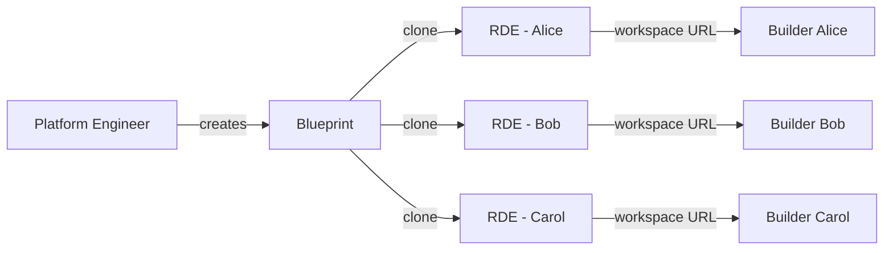

## Overview

Remote Development Environments (RDE) give every team member -- including non-technical builders -- the ability to build and ship software in a secure, cloud-based workspace. Platform engineers define the environment once as a **blueprint**, and Qovery clones it on demand for each builder with full isolation, RBAC, and cost controls.

The typical scenario: your organization has people who are technically curious -- they can build with AI-assisted coding tools, low-code platforms, or simple scripts -- but they are not infrastructure engineers. They need a safe, pre-configured environment where they can work autonomously without risking production systems or depending on the platform team for every deployment.

RDE solves this by separating **who defines the environment** (platform engineers) from **who uses it** (builders), so both sides get what they need: control and autonomy.

## Why Remote Development Environments?

<CardGroup cols={3}>
  <Card title="Builder Autonomy" icon="wand-magic-sparkles">
    Non-technical builders can build and deploy without depending on platform or DevOps teams
  </Card>

  <Card title="Platform Control" icon="shield-halved">
    SREs and platform engineers define blueprints, security boundaries, and RBAC policies
  </Card>

  <Card title="Security & Compliance" icon="lock">
    Builders work in sandboxed environments on your own infrastructure -- SOC2, ISO 27001, DORA compliant
  </Card>

  <Card title="Cost Efficiency" icon="dollar-sign">
    Environments spin up on demand and auto-stop when idle via TTL jobs
  </Card>

  <Card title="Consistent Setup" icon="clone">
    Every builder gets the same pre-configured workspace with the right tools, dependencies, and access
  </Card>

  <Card title="Fast Onboarding" icon="rocket">
    New team members are productive in minutes -- no local setup, no configuration drift
  </Card>
</CardGroup>

## How It Works

RDE is built on a two-tier system:

1. **Blueprints** -- Template projects and environments created by platform engineers. A blueprint contains everything a builder needs: workspace (VS Code, IDE), databases, services, environment variables, and configuration.
2. **RDE Instances** -- Cloned from a blueprint for each builder. Each instance is an isolated environment with its own project, RBAC role, and workspace URL.



When a platform engineer runs `qovery rde create`, Qovery:

1. Creates a new project for the builder (e.g., `rde-alice`)
2. Creates an RBAC role scoped to that project
3. Clones the blueprint environment into the new project
4. Updates the TTL job to target the new environment (for auto-stop)
5. Invites the builder via email
6. Triggers deployment

The builder receives an email, clicks the workspace URL, and starts building -- no CLI, no Kubernetes knowledge required on their end.

## Who Is This For?

<CardGroup cols={2}>
  <Card title="Platform Engineers / SREs" icon="server">
    **You set up and control the platform.**

    - Create and maintain blueprint environments
    - Define security boundaries and RBAC policies
    - Provision RDEs for builders via CLI
    - Monitor usage, manage lifecycle, control costs
    - Upgrade all RDEs when the blueprint evolves
  </Card>

  <Card title="Builders / Non-Technical Team Members" icon="hammer">
    **You use the workspace to build and deploy.**

    - Accept an email invitation
    - Open your workspace URL in the browser
    - Build with AI-assisted coding tools (VS Code, Claude Code, OpenCode)
    - Deploy and test your applications in isolation
    - Focus on building -- the platform handles the rest
  </Card>
</CardGroup>

## Two Approaches

<CardGroup cols={2}>
  <Card title="CLI-Based Management" icon="terminal">
    **Available Now**

    Platform engineers use the Qovery CLI to provision and manage RDEs. Full control over every aspect: blueprint registration, RDE creation, lifecycle management, upgrades, and cleanup.

    - Scriptable and automatable
    - Full control over RBAC, TTL, and deployment
    - Ideal for platform teams who want maximum flexibility
    - Works today

    **Best for:** Technical platform teams managing RDEs for their organization
  </Card>

  <Card title="Self-Service Portal" icon="browser">
    **Coming Soon**

    A web portal where builders create their own environments with one click -- no CLI, no Kubernetes knowledge needed. SSO login, pick a template, click "Create".

    - Web-based UI for non-technical users
    - SSO authentication (Google, Okta, Azure AD, OIDC)
    - One-click environment creation from templates
    - Dashboard with status, URLs, and TTL controls
    - Per-builder environment limits

    **Best for:** Organizations with many non-technical builders who need full self-service
  </Card>
</CardGroup>

## Prerequisites

<Warning>
**Cluster Required**: Before setting up RDEs, you need a Kubernetes cluster managed by Qovery. RDE environments will be deployed on this cluster.
</Warning>

<Check>You have a [Qovery account](https://console.qovery.com)</Check>
<Check>You have a running Kubernetes cluster on Qovery ([setup guide](/getting-started/quickstart/cloud))</Check>
<Check>You have the [Qovery CLI installed](/cli/overview)</Check>
<Check>You have a project with at least one environment to use as a blueprint template</Check>

## Getting Started with the CLI

### Step 1: Install and Authenticate

<Snippet file="install-qovery-cli.mdx" />

Then authenticate with your Qovery account:

```bash
qovery auth
```

### Step 2: Create Your Blueprint

A blueprint is a project containing a template environment that will be cloned for each builder. A good blueprint includes:

- **A workspace service** -- VS Code Server, or any browser-based IDE your builders will use
- **Databases and services** -- Any backing services builders need (PostgreSQL, Redis, etc.)
- **Environment variables** -- Pre-configured credentials, API keys, and settings
- **A TTL job** (optional) -- A lifecycle job that auto-stops idle environments to save costs

<Tip>
Start simple. You can always iterate on the blueprint based on builder feedback. A workspace service with basic dependencies is enough to get started.
</Tip>

Once your project and environment are ready, register it as a blueprint:

```bash
qovery rde blueprint register \
  --organization "my-org" \
  --project "builder-workspace"
```

Verify registration:

```bash
qovery rde blueprint list --organization "my-org"
```

### Step 3: Deploy the Blueprint

Deploy the blueprint environment to validate that everything works:

```bash
qovery rde blueprint deploy \
  --organization "my-org" \
  --project "builder-workspace" \
  --watch
```

<Tip>
Always validate your blueprint by deploying and testing it before provisioning RDEs for builders. This ensures every cloned environment works out of the box.
</Tip>

Once validated, stop the blueprint environment to save resources:

```bash
qovery rde blueprint stop \
  --organization "my-org" \
  --project "builder-workspace" \
  --watch
```

### Step 4: Provision an RDE for a Builder

Create an RDE for a team member:

```bash
qovery rde create \
  --organization "my-org" \
  --blueprint "builder-workspace" \
  --cluster "my-cluster" \
  --name "alice" \
  --email "alice@company.com"
```

This command:
1. Creates a new project `rde-alice`
2. Creates an RBAC role `RDE-alice` scoped to this project
3. Clones the blueprint environment into `rde-alice`
4. Updates the TTL job to target the new environment
5. Sends an email invitation to `alice@company.com`
6. Triggers deployment automatically

### Step 5: Share the Workspace URL

Once the RDE is deployed, get the workspace URLs:

```bash
qovery rde urls --organization "my-org"
```

Share the workspace URL with the builder. They can open it in their browser to access their pre-configured development environment.

### Step 6: Verify

Check the status of the RDE:

```bash
qovery rde status --organization "my-org" --name "alice"
```

List all RDEs across the organization:

```bash
qovery rde list --organization "my-org"
```

## For Builders: Using Your RDE

As a builder, your platform engineer handles all the infrastructure setup. Here is what you need to do:

<Steps>
  <Step title="Accept the Invitation">
    Check your email for a Qovery invitation from your platform engineer. Click the link to join your organization on Qovery.
  </Step>

  <Step title="Access Your Workspace">
    Open the workspace URL provided by your platform engineer (or find it in the Qovery console). You will have a browser-based IDE (e.g., VS Code) with all tools and dependencies pre-installed.
  </Step>

  <Step title="Start Building">
    Your environment is fully isolated -- you cannot affect production or other builders' environments. Build, test, and deploy freely. If you use AI-assisted coding tools (Claude Code, OpenCode, GitHub Copilot), they work out of the box in your workspace.
  </Step>

  <Step title="Get Help When Needed">
    If something is not working, reach out to your platform engineer. They can check your RDE status, view logs, and restart your environment if needed.
  </Step>
</Steps>

## Managing RDEs

### Day-to-Day Operations

| Task | Command |
|------|---------|
| List all RDEs | `qovery rde list --organization "my-org"` |
| Check RDE status | `qovery rde status --organization "my-org" --name "alice"` |
| Start an RDE | `qovery rde start --organization "my-org" --name "alice" --watch` |
| Stop an RDE | `qovery rde stop --organization "my-org" --name "alice" --watch` |
| Start all RDEs | `qovery rde start-all --organization "my-org"` |
| Stop all RDEs | `qovery rde stop-all --organization "my-org"` |
| View logs | `qovery rde logs --organization "my-org" --name "alice"` |
| Get workspace URLs | `qovery rde urls --organization "my-org"` |

### Upgrading RDEs

When your blueprint evolves (new tools, updated dependencies, security patches), upgrade existing RDEs to stay in sync:

**Image strategy** (default) -- Redeploy the environment with the latest images. Safe, no data loss:

```bash
qovery rde upgrade --organization "my-org" --name "alice"
```

**Reclone strategy** -- Delete the environment and re-clone from the blueprint. Use when the blueprint structure has changed significantly:

```bash
qovery rde upgrade --organization "my-org" --name "alice" --strategy "reclone"
```

<Warning>
The `reclone` strategy will destroy the existing environment and recreate it from the blueprint. Any uncommitted work in the builder's workspace will be lost.
</Warning>

To upgrade all RDEs at once:

```bash
qovery rde upgrade --organization "my-org"
```

### Cleaning Up

Delete a single RDE (stops the environment, deletes the project, RBAC role, and API token):

```bash
qovery rde delete --organization "my-org" --name "alice" --watch
```

Delete all RDEs:

```bash
qovery rde delete-all --organization "my-org" --confirm
```

## Self-Service Portal

<Info>
The Self-Service Portal is an upcoming capability. Contact your Qovery account manager or reach out on Slack for early access.
</Info>

While the CLI gives platform engineers full control over RDE management, the **Self-Service Portal** is designed for organizations that want to give builders complete autonomy -- without requiring them to use a CLI or understand infrastructure concepts.

### What Is the Self-Service Portal?

The portal is a web application deployed on your own Qovery infrastructure where non-technical builders can:

- **Log in via SSO** (Google, Okta, Azure AD, or any OIDC provider)
- **Browse available templates** (blueprints configured by platform engineers)
- **Create an environment with one click** -- pick a template, click "Create", and wait for it to spin up
- **See a dashboard** of their environments with real-time status, workspace URLs, and TTL countdown
- **Manage lifecycle** -- start, stop, extend TTL, or delete their environments directly from the UI

No CLI. No Kubernetes knowledge. No Slack messages asking the platform team to spin up an environment.

### How It Complements the CLI

The portal does not replace the CLI -- it builds on top of it:

| Aspect | CLI | Portal |
|--------|-----|--------|
| **Audience** | Platform engineers | Builders (non-technical) |
| **Blueprint setup** | CLI (`qovery rde blueprint register`) | N/A -- platform engineers still use the CLI |
| **RDE creation** | CLI (`qovery rde create`) | One-click in the browser |
| **RDE lifecycle** | CLI (`qovery rde start/stop/delete`) | Dashboard buttons |
| **Bulk operations** | CLI (`qovery rde start-all/upgrade`) | N/A -- platform engineers still use the CLI |
| **Authentication** | Qovery CLI auth | SSO (Google, Okta, Azure AD, OIDC) |

Platform engineers continue to use the CLI to set up blueprints, configure RBAC, and manage the platform. The portal is the builder-facing layer that abstracts all of that complexity.

### Key Capabilities

<CardGroup cols={2}>
  <Card title="SSO Authentication" icon="key">
    Builders log in with their existing corporate identity. Supports Google Workspace, Okta, Azure AD, and generic OIDC providers.
  </Card>

  <Card title="Template-Based Creation" icon="layer-group">
    Platform engineers define templates (blueprints) with specific tools and services. Builders pick the template that fits their use case.
  </Card>

  <Card title="Real-Time Dashboard" icon="chart-line">
    Each builder sees their environments with live status, workspace URLs, and TTL remaining. No need to ask anyone for a URL or status update.
  </Card>

  <Card title="Per-Builder Limits" icon="gauge">
    Platform engineers can set a maximum number of environments per builder to control costs and resource usage.
  </Card>
</CardGroup>

## Best Practices

<AccordionGroup>
  <Accordion title="Keep blueprints lean and focused">
    Include only what builders actually need. A bloated blueprint means slower clone times and higher costs. Start with a workspace service and basic dependencies, then add more based on feedback.
  </Accordion>

  <Accordion title="Always use RBAC">
    The `--skip-rbac` flag exists for testing, but in production always let Qovery create scoped RBAC roles. This ensures builders can only access their own environment and cannot accidentally modify other projects.
  </Accordion>

  <Accordion title="Configure TTL jobs for cost control">
    Include a TTL (time-to-live) lifecycle job in your blueprint that auto-stops idle environments. This prevents forgotten environments from running indefinitely and accumulating costs.
  </Accordion>

  <Accordion title="Use meaningful naming conventions">
    Name RDEs after the builder (`--name "alice"`) or their role (`--name "marketing-bob"`). This makes it easy to identify and manage environments at scale.
  </Accordion>

  <Accordion title="Upgrade regularly">
    When you update the blueprint (new tools, security patches, dependency updates), upgrade all RDEs using `qovery rde upgrade`. The default `image` strategy is safe and non-disruptive.
  </Accordion>

  <Accordion title="Prepare an onboarding guide for builders">
    Write a short internal guide for your builders: how to access their workspace, what tools are available, how to deploy, and who to contact for help. The less friction, the more adoption.
  </Accordion>
</AccordionGroup>

## Next Steps

<CardGroup cols={2}>
  <Card title="RDE CLI Reference" icon="terminal" href="/cli/commands/rde">
    Full reference for all `qovery rde` commands, flags, and examples
  </Card>

  <Card title="Ephemeral Environments" icon="clock" href="/getting-started/guides/use-cases/ephemeral-environment">
    Learn about on-demand temporary environments for development and testing
  </Card>

  <Card title="Cluster Setup" icon="cloud" href="/getting-started/quickstart/cloud">
    Set up a Kubernetes cluster on AWS, GCP, Azure, or Scaleway
  </Card>

  <Card title="Preview Environments" icon="code-branch" href="/getting-started/guides/use-cases/preview-environments">
    Automatically create environments for every pull request
  </Card>
</CardGroup>
