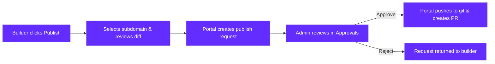

<Warning>
**Preview**: Remote Dev Environments Portal is in preview. Features may change as the product evolves.
</Warning>

## Overview

The publish workflow lets builders **request deployment of their workspace application** to a production URL. As an admin, you review these requests and approve or reject them before anything goes live. This gives you oversight over what gets published while still letting builders work autonomously.

## How the Publish Flow Works

<Steps>
  <Step title="Builder Initiates Publish">
    The builder clicks **Publish** in their workspace editor when they are ready to deploy their application.
  </Step>

  <Step title="Builder Configures the Request">
    The builder selects a subdomain for their published application and reviews a diff of the changes being published.
  </Step>

  <Step title="Publish Request Created">
    The portal creates a git commit with the workspace changes and generates a publish request. The request appears in the admin approvals queue.
  </Step>

  <Step title="Admin Reviews">
    You see the pending request in **Admin > Approvals** with all the details needed to make a decision.
  </Step>

  <Step title="Admin Approves or Rejects">
    - **Approve** - The portal pushes the commit to git and creates a pull request for deployment.
    - **Reject** - The request is sent back to the builder with optional feedback explaining why.
  </Step>
</Steps>

## Reviewing Requests

Navigate to **Admin > Approvals** to see all pending publish requests. Each request includes:

| Field | Description |
|-------|-------------|
| **Workspace Name** | The workspace the builder is publishing from |
| **Builder Email** | Who submitted the request |
| **Subdomain** | The requested subdomain for the published application |
| **Timestamp** | When the publish request was submitted |
| **Diff Preview** | A summary of the changes included in the publish |

Review the diff to understand what the builder is publishing. Look for anything unexpected - incorrect configurations, sensitive data, or incomplete work.

## Approving a Request

Click **Approve** on a publish request to trigger the deployment pipeline. The portal will:

1. Push the builder's commit to the git repository
2. Create a pull request with the changes
3. Mark the publish request as approved

The builder is notified that their request was approved.

## Rejecting a Request

Click **Reject** to send the request back to the builder. You can include an optional **feedback message** explaining why the request was rejected and what the builder should change before resubmitting.

The builder sees the rejection with your feedback in their workspace and can make adjustments before submitting a new publish request.

## Trusted Users

For experienced builders who consistently publish appropriate content, you can grant **trusted status**. Trusted users' publish requests are **auto-approved** - they bypass the admin review step entirely.

<Steps>
  <Step title="Navigate to Trust Settings">
    Go to the **Admin > Approvals** page or open the blueprint settings for the relevant blueprint.
  </Step>

  <Step title="Find the User">
    Locate the user you want to trust in the list.
  </Step>

  <Step title="Toggle Trust Status">
    Enable the **Trusted** toggle for the user. Their future publish requests from this blueprint will be auto-approved.
  </Step>
</Steps>

<Warning>
Trusted users bypass the approval step entirely. Only grant trust to users you are confident will publish appropriate content. You can revoke trust at any time by toggling the setting off.
</Warning>

<Info>
Trust is configured **per user**. You can trust a user for one blueprint but still require approval for their requests on other blueprints. Review your trusted users list periodically to ensure it stays current.
</Info>

## Next Steps

<CardGroup cols={3}>
  <Card title="Workspace Management" icon="server" href="/rde/admin/workspace-management">
    Monitor and manage all workspaces.
  </Card>
  <Card title="Member Management" icon="users" href="/rde/admin/member-management">
    Invite and manage team members.
  </Card>
  <Card title="Portal Customization" icon="palette" href="/rde/admin/portal-customization">
    Customize branding and workspace layouts.
  </Card>
</CardGroup>
