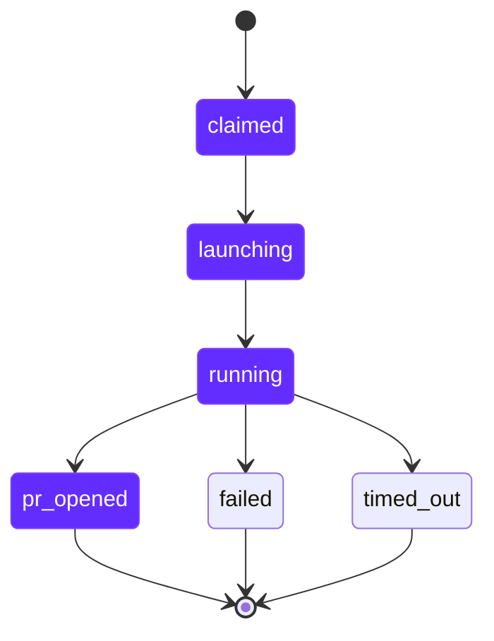

import RdePreviewWarning from "/snippets/rde-preview-warning.mdx";

<RdePreviewWarning />

## Overview

Autonomous agents pick up Linear issues, work on them in isolated cloud workspaces, and open pull requests - without human intervention. This guide walks you through creating an agent blueprint and triggering your first run.

## Prerequisites

Before starting, make sure you have:

- AI Builder Portal configured - see [Admin Setup](/rde/getting-started/admin-setup)
- A running Kubernetes cluster on Qovery
- A Linear workspace with API access connected to the portal
- A git repository the agent will work on
- An API key for your chosen AI runtime (Anthropic, OpenAI, or Google)

## Create an Agent Blueprint

<Steps>
  <Step title="Navigate to Blueprints">
    Go to **Admin > Blueprints** and click **Create Blueprint**. In the type chooser dialog, select **Agent Blueprint**.
  </Step>

  <Step title="Choose a Runtime">
    Select one of the five supported AI runtimes:

    | Runtime | Command | API Key Variable |
    |---------|---------|-----------------|
    | Claude Code | `claude -p` | `ANTHROPIC_API_KEY` |
    | OpenCode | `opencode run` | `ANTHROPIC_API_KEY` |
    | Codex | `codex --full-auto` | `OPENAI_API_KEY` |
    | Gemini CLI | `gemini -p` | `GEMINI_API_KEY` |
    | Cursor CLI | `cursor-agent` | `ANTHROPIC_API_KEY` |

    Optionally enter the API key for the selected runtime. The key is stored encrypted and injected into the workspace at launch.
  </Step>

  <Step title="Configure Repositories">
    Add one or more git repositories the agent will work on.

    For each repository:
    - **URL** (required) - the HTTPS clone URL
    - **Branch** - defaults to `main`
    - **Token** - optional, required for private repositories

    At least one repository URL must be provided.
  </Step>

  <Step title="Connect to Linear">
    Configure the Linear integration that drives the agent's work queue.

    **Required fields:**
    - **Linear Team** - the team whose issues the agent will pick up
    - **Issue Label** - the label that triggers a run (default: `qovery-agent-ready`)
    - **In-Progress State** - the workflow state the issue transitions to when claimed by the agent

    **Optional fields:**
    - **In-Review State** - the workflow state when the agent opens a PR
    - **Needs-Human State** - the workflow state when the agent fails or times out

    **Resource limits:**
    - **Max concurrent runs** - how many issues the agent works on simultaneously (default: `3`)
    - **Run timeout** - maximum duration per run in minutes (default: `60`)

    <Tip>
    Under **Advanced**, you can customize the blueprint name (default: `Autonomous Agent`), description, target cluster, and resource allocation (CPU, memory, storage). The defaults - 4000 mCPU, 4096 MB memory, 10 GB storage - work well for most workloads.
    </Tip>
  </Step>

  <Step title="Create the Blueprint">
    Click **Create**. The portal provisions a Qovery project and environment for the agent. Once complete, the blueprint appears in your admin panel under **Admin > Blueprints**.
  </Step>
</Steps>

## Trigger Your First Run

1. Open your Linear workspace and navigate to the team you configured in the blueprint.
2. Create or select an existing issue.
3. Add the trigger label to the issue (e.g., `qovery-agent-ready`).
4. The background runner picks up the labeled issue within 60 seconds.
5. The issue automatically transitions to the **In-Progress** state, and a comment is posted on the issue confirming the agent has claimed it.

<Info>
The background runner polls Linear every 60 seconds. There may be up to a one-minute delay between labeling an issue and the agent claiming it.
</Info>

## Monitor the Run

Navigate to **Admin > Agents > Runs** to watch the agent work.

A run progresses through these statuses:

- **claimed** - the agent has picked up the issue and reserved it
- **launching** - the cloud workspace is being provisioned
- **running** - the AI runtime is actively working on the issue
- **pr_opened** - the agent opened a pull request (success)
- **failed** - the agent encountered an error
- **timed_out** - the run exceeded the configured timeout

The runs table auto-refreshes every 30 seconds. When a run completes successfully, the PR URL appears in the table.

## What Happens Under the Hood

<Tip>
Here is what the system does end-to-end when an issue is labeled:

1. The background runner polls Linear every 60 seconds for issues with the trigger label.
2. It claims the issue atomically - a database constraint prevents duplicate runs for the same issue.
3. The issue transitions to the In-Progress state and a lifecycle comment is posted.
4. A cloud workspace launches with the configured runtime, repositories, and API key.
5. The AI agent receives the issue title, description, and context, then works on the code.
6. When the agent finishes, it reports the result (PR URL or error) back via a callback.
7. The portal stops the workspace, updates the Linear issue state, and posts a final comment with the outcome.
</Tip>

## Next Steps

<CardGroup cols={2}>
  <Card title="Agent Blueprints" icon="robot" href="/rde/agents/agent-blueprints">
    Deep dive on agent blueprint configuration, runtimes, and resource tuning.
  </Card>
  <Card title="Managing Runs" icon="list-check" href="/rde/agents/managing-runs">
    Monitor active runs, review logs, and handle failures.
  </Card>
  <Card title="Linear Integration" icon="arrows-rotate" href="/rde/agents/linear-integration">
    Configure the issue flow, labels, and workflow state mapping.
  </Card>
</CardGroup>
