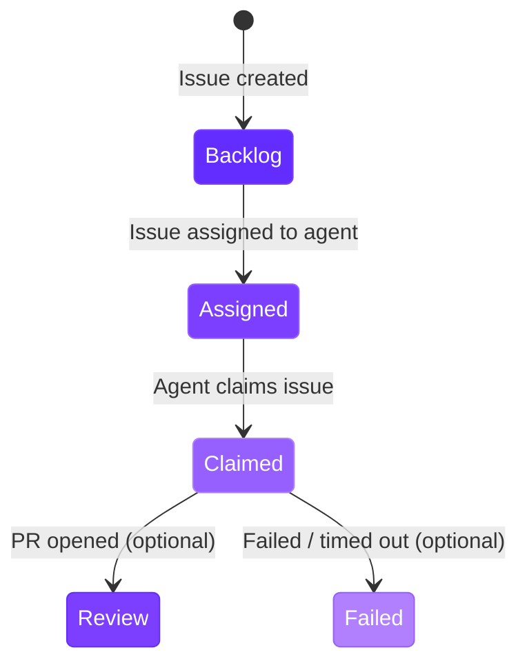

import RdePreviewWarning from "/snippets/rde-preview-warning.mdx";

<RdePreviewWarning />

## Overview

Autonomous agents integrate with Jira via OAuth 2.0 (3LO). When a user assigns a Jira issue to the agent's Jira user, Jira sends a webhook to the portal, which claims the issue, launches a workspace, and reports progress back on the issue as comments and workflow status transitions. No polling and no labels are required for triggering.

Unlike Linear, Jira has no native agent-activity UI, so all progress is reported through issue comments and status transitions.

## Connecting Jira

<Steps>
  <Step title="Open settings">
    Navigate to **Admin > Settings** in the portal.
  </Step>
  <Step title="Add to Jira">
    In the **Jira Agent** section, click the **Add to Jira** button.
  </Step>
  <Step title="Authorize the agent">
    Authorize the Qovery agent on Atlassian's consent screen. The agent requests the following scopes: `read:jira-work`, `write:jira-work`, `read:jira-user`, `offline_access`, and `read:me`.
  </Step>
  <Step title="Confirm connection">
    You are redirected back to the portal. A green **Jira connected** badge confirms the connection.
  </Step>
</Steps>

On connect, the portal resolves your Jira site (cloud ID) and the agent app's account ID, stores the OAuth tokens encrypted, and automatically registers a webhook. The token auto-refreshes automatically - no manual token management is required.

<Warning>
Without a connected Jira site, agent blueprints configured for Jira cannot respond to issues.
</Warning>

## How the Issue Flow Works

The following diagram shows the end-to-end flow from assigning the agent on an issue to receiving a pull request.

```mermaid
sequenceDiagram
    participant Dev as Developer
    participant Jira as Jira
    participant Portal as Portal Session Handler
    participant DB as Database
    participant WS as Workspace

    Dev->>Jira: Assigns issue to the agent user
    Jira->>Portal: issue_updated webhook (JWT-verified)
    Portal->>Portal: Verifies JWT
    Portal->>Portal: Responds 200 fast, processes async
    Portal->>Portal: Detects assignee change to the agent account
    Portal->>Portal: Finds matching blueprint by project
    Portal->>DB: Claims issue atomically
    Note over DB: UNIQUE constraint on<br/>(org_id, provider, issue_id)<br/>prevents duplicates
    Portal->>Jira: Posts a comment ("starting work")
    Portal->>Jira: Transitions issue to Claimed status
    Portal->>WS: Launches workspace with agent config

    WS->>Jira: Posts milestone progress comments

    alt Success
        WS->>Portal: Callback with PR URL
        Portal->>Jira: Posts comment with PR link
        Portal->>Jira: Transitions issue to Review status
        Portal->>WS: Keeps workspace briefly, then cleans up
    else Failure or Timeout
        WS->>Portal: Callback with error
        Portal->>Jira: Posts comment with failure reason
        Portal->>Jira: Transitions issue to Failed status
        Portal->>WS: Deletes workspace
    end

    style Dev fill:#642DFF,color:#fff
    style Jira fill:#7C3FFF,color:#fff
    style Portal fill:#965FFF,color:#fff
    style DB fill:#B080FF,color:#fff
    style WS fill:#7C3FFF,color:#fff
```

## Configuring the Project

Each agent blueprint monitors one Jira project. Only issues from the configured project are picked up by that blueprint.

The project dropdown in the blueprint wizard uses the OAuth connection to list all available projects. To monitor multiple projects, create separate agent blueprints - one per project.

| Blueprint Setting | Value |
|---|---|
| **Jira Project** | Required. The project whose issues the agent monitors. |

## Status Mapping

Agent blueprints map three Jira statuses to key moments in the run lifecycle. These transitions keep your Jira board in sync with agent activity.

### Claimed Status (required)

Set when the agent claims the issue and begins work. This signals to the team that work has started.

The blueprint cannot function without this status configured.

### Review Status (optional)

Set when the agent successfully opens a pull request. If not configured, the issue status is not changed on success - only a comment with the PR URL is posted.

### Failed Status (optional)

Set when the agent fails or the run times out. If not configured, the issue status is not changed on failure - only a comment with the failure reason is posted.



| Status | Required | When Set | Fallback if Not Configured |
|---|---|---|---|
| **Claimed** | Yes | Agent claims the issue | Blueprint will not process issues |
| **Review** | No | Agent opens a PR | Comment posted, status unchanged |
| **Failed** | No | Agent fails or times out | Comment posted, status unchanged |

## Progress Reporting in Jira

Jira has no native agent UI, so the agent reports progress through issue comments alongside the status transitions above.

| Moment | Reported As |
|---|---|
| **Started** | Comment "Qovery agent is starting work..." + transition to Claimed status |
| **Workspace launched** | Comment with the agent runtime and the RDE dashboard link |
| **Progress** | Milestone comments as the run proceeds |
| **PR opened** | Comment with the pull request link + transition to Review status |
| **Failed** | Comment with the failure reason + transition to Failed status |
| **Timed out** | Comment noting the timeout + transition to Failed status |
| **Stopped** | Comment "Stopped working on this issue." |

<Info>
Comments authored by the agent are ignored by the webhook handler to prevent feedback loops.
</Info>

## Interacting with Agents from Jira

### Follow-up Instructions

While an agent is running, users can post follow-up instructions as comments on the Jira issue. The agent processes these messages and can adjust its approach. If the run has already reached a terminal state (PR opened, failed, or timed out), a follow-up comment revives it by launching a fresh workspace with the new instruction.

### Stop Signal

There are two ways to stop a running agent from Jira:

| Action | Effect |
|---|---|
| Post a comment containing `/stop` | Stops the workspace and marks the run as failed |
| Unassign the issue from the agent user | Stops the workspace and marks the run as failed |

When stopped, the portal stops the environment, records the reason, and posts a "Stopped working on this issue." comment.

<Tip>
This gives your team a way to guide autonomous agents without leaving Jira. If an agent is heading in the wrong direction, post a clarifying comment or unassign the issue to stop it.
</Tip>

## Concurrency and Timing

### Max Concurrent Runs

Each blueprint has a configurable concurrency cap (default: **3**). When the number of active runs (status `claimed`, `launching`, or `running`) reaches this limit, incoming webhooks for that blueprint are queued until a slot opens.

### Run Timeout

Each run has a maximum duration (default: **60 minutes**). When the timeout is reached, the workspace is stopped, the run status is set to `timed_out`, and a comment is posted on the Jira issue. If a Failed status is configured, the issue transitions to that status.

### Atomic Claiming

When the webhook fires, the session handler claims the issue atomically via a database unique constraint on `(org_id, provider, issue_id)`. This prevents duplicate runs even if the assignment event fires multiple times on the same issue.

## Webhook Security and Lifecycle

Incoming Jira webhooks are verified as JWTs signed with the agent app's client secret (HS256, with a required expiry claim). Atlassian webhooks expire after 30 days, so the portal automatically refreshes the registered webhook on a daily background job. No action is required on your part.

## Disconnecting Jira

To disconnect, navigate to **Admin > Settings** and click the **Disconnect** link under the **Jira Agent** section. This revokes the OAuth tokens and removes the organization mapping. Existing runs are not affected, but no new runs can be triggered.

## Future Integrations

<Info>
**GitHub Issues** integration is planned. If you need a specific integration, contact the Qovery team.
</Info>

## Next Steps

<CardGroup cols={3}>
  <Card title="Agent Blueprints" icon="cubes" href="/rde/agents/agent-blueprints">
    Configure blueprints that define how agents run, including runtimes, repositories, and resource limits.
  </Card>
  <Card title="Managing Runs" icon="list-check" href="/rde/agents/managing-runs">
    Monitor active runs, review results, and troubleshoot failures.
  </Card>
  <Card title="Getting Started" icon="play" href="/rde/agents/getting-started">
    Set up your first autonomous agent from scratch.
  </Card>
</CardGroup>
