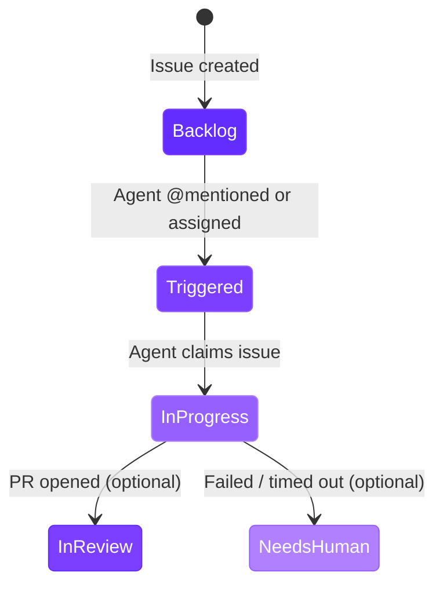

import RdePreviewWarning from "/snippets/rde-preview-warning.mdx";

<RdePreviewWarning />

## Overview

Autonomous agents integrate with Linear via OAuth. When a user @mentions or assigns the agent on a Linear issue, Linear sends a webhook to the portal, which instantly claims the issue, launches a workspace, and streams progress back to Linear. No polling and no labels are required for triggering.

Linear and Jira are both supported. For Jira, see [Jira Integration](/rde/agents/jira-integration).

## Connecting Linear

<Steps>
  <Step title="Open settings">
    Navigate to **Admin > Settings** in the portal.
  </Step>
  <Step title="Add to Linear">
    In the **Autonomous Agent** section, click the **Add to Linear** button.
  </Step>
  <Step title="Authorize the agent">
    Authorize the Qovery agent in Linear's consent screen. The agent requests access to issues, comments, workflow states, and teams.
  </Step>
  <Step title="Confirm connection">
    You are redirected back to the portal. A green **Linear Agent connected** badge confirms the connection.
  </Step>
</Steps>

The OAuth token auto-refreshes automatically. No manual token management is required.

<Warning>
Without a connected Linear workspace, agent blueprints cannot respond to issues.
</Warning>

## How the Issue Flow Works

The following diagram shows the end-to-end flow from @mentioning or assigning the agent on an issue to receiving a pull request.

```mermaid
sequenceDiagram
    participant Dev as Developer
    participant Linear as Linear
    participant Portal as Portal Session Handler
    participant DB as Database
    participant WS as Workspace

    Dev->>Linear: @mentions or assigns agent on issue
    Linear->>Portal: AgentSessionEvent webhook (HMAC-SHA256)
    Portal->>Portal: Verifies signature
    Portal->>Portal: Acknowledges within 10s
    Portal->>Portal: Finds matching blueprint by team
    Portal->>DB: Claims issue atomically
    Note over DB: UNIQUE constraint on<br/>(org_id, linear_issue_id)<br/>prevents duplicates
    Portal->>Linear: Sets agent as delegate on issue
    Portal->>Linear: Posts 4-step plan activity
    Portal->>WS: Launches workspace with agent config

    WS->>Linear: Streams thought activities (progress)

    alt Success
        WS->>Portal: Callback with PR URL
        Portal->>Linear: Updates plan (all steps completed)
        Portal->>Linear: Adds external URL (PR link)
        Portal->>Linear: Posts response activity with PR URL
        Portal->>Linear: Transitions issue state
        Portal->>WS: Keeps workspace briefly, then cleans up
    else Failure or Timeout
        WS->>Portal: Callback with error
        Portal->>Linear: Updates plan (failed step)
        Portal->>Linear: Posts error activity with details
        Portal->>Linear: Transitions to Needs-Human state
        Portal->>WS: Deletes workspace
    end

    style Dev fill:#642DFF,color:#fff
    style Linear fill:#7C3FFF,color:#fff
    style Portal fill:#965FFF,color:#fff
    style DB fill:#B080FF,color:#fff
    style WS fill:#7C3FFF,color:#fff
```

## Configuring Teams

Each agent blueprint monitors one Linear team. Only issues from the configured team are picked up by that blueprint.

The team dropdown in the blueprint settings uses the OAuth connection to list all available teams. To monitor multiple teams, create separate agent blueprints - one per team.

| Blueprint Setting | Value |
|---|---|
| **Linear Team** | Required. The team whose issues the agent monitors. |

## Workflow State Mapping

Agent blueprints map three Linear workflow states to key moments in the run lifecycle. These state transitions keep your Linear board in sync with agent activity.

### In-Progress State (required)

Set when the agent claims the issue. This signals to the team that work has started and prevents the issue from being picked up by another agent or assigned manually.

The blueprint cannot function without this state configured. If autonomous mode is enabled but no In-Progress state is set, the blueprint will not process issues.

### In-Review State (optional)

Set when the agent successfully opens a pull request. If not configured, the issue state is not changed on success - only a lifecycle comment with the PR URL is posted.

### Needs-Human State (optional)

Set when the agent fails or the run times out. If not configured, the issue state is not changed on failure - only a lifecycle comment with the failure reason is posted.



| State | Required | When Set | Fallback if Not Configured |
|---|---|---|---|
| **In-Progress** | Yes | Agent claims the issue | Blueprint will not process issues |
| **In-Review** | No | Agent opens a PR | Comment posted, state unchanged |
| **Needs-Human** | No | Agent fails or times out | Comment posted, state unchanged |

## Agent Activities in Linear

When a run starts, the agent posts structured activities directly in the Linear issue - visible inline to all team members.

### Agent Plan

A 4-step checklist appears in the Linear issue:

1. **Analyzing issue**
2. **Setting up workspace**
3. **Running AI agent**
4. **Opening pull request**

Each step updates to in-progress or completed as the run progresses. If a step fails, it is marked accordingly.

### Progress Updates

The agent streams live "thought" activities from the workspace. These appear as real-time status updates in the Linear issue thread, giving the team visibility into what the agent is doing at each moment.

### External URLs

The session sidebar in Linear shows direct links to:

- The **RDE dashboard** for the current run
- The **pull request** (when available)

### Final Result

On success, the agent posts a **response** activity containing the PR link. On failure, it posts an **error** activity with the failure details.

<Info>
Traditional comments are also posted on the issue for audit trail purposes.
</Info>

## Interacting with Agents from Linear

### Bidirectional Messaging

While an agent is running, users can post follow-up instructions as comments on the Linear issue. The agent processes these messages and can adjust its approach. Messages are delivered to the workspace via a polling endpoint (approximately every 5 seconds).

### Stop Signal

Linear's native stop button works. When pressed, the portal stops the workspace and marks the run as failed.

### Slash Commands

You can also control agents by posting a comment with one of these commands:

| Command | Action |
|---------|--------|
| `/stop` | Stop the agent and its workspace environment |
| `/restart` | Restart the workspace environment |
| `/delete` | Stop the agent and mark the run as done |
| `/status` | Show the current agent status and workspace state |

Commands are processed by the portal and take effect within seconds. The system posts a confirmation comment on the issue when the action completes.

<Tip>
This gives your team a way to guide autonomous agents without leaving Linear. If an agent is heading in the wrong direction, post a clarifying comment or stop it and provide more context.
</Tip>

## Concurrency and Timing

### Max Concurrent Runs

Each blueprint has a configurable concurrency cap (default: **3**). When the number of active runs (status `claimed`, `launching`, or `running`) reaches this limit, incoming webhooks for that blueprint are queued until a slot opens.

### Run Timeout

Each run has a maximum duration (default: **60 minutes**). When the timeout is reached, the workspace is stopped, the run status is set to `timed_out`, and a lifecycle comment is posted on the Linear issue. If a Needs-Human state is configured, the issue transitions to that state.

### Atomic Claiming

When the webhook fires, the session handler claims the issue atomically via a database unique constraint on `(org_id, linear_issue_id)`. This prevents duplicate runs even if the agent is @mentioned multiple times on the same issue.

## Disconnecting Linear

To disconnect, navigate to **Admin > Settings** and click the **Disconnect** link under the **Autonomous Agent** section. This revokes the OAuth tokens and removes the organization mapping. Existing runs are not affected, but no new runs can be triggered.

## Other Trackers

<Info>
**Jira** is also supported - see [Jira Integration](/rde/agents/jira-integration). A **GitHub Issues** integration is planned. If you need a specific integration, contact the Qovery team.
</Info>

## Next Steps

<CardGroup cols={3}>
  <Card title="Agent Blueprints" icon="cubes" href="/rde/agents/agent-blueprints">
    Configure blueprints that define how agents run, including runtimes, repositories, and resource limits.
  </Card>
  <Card title="Managing Runs" icon="list-check" href="/rde/agents/managing-runs">
    Monitor active runs, review results, and troubleshoot failures.
  </Card>
  <Card title="Getting Started" icon="play" href="/rde/agents/getting-started">
    Set up your first autonomous agent from scratch.
  </Card>
</CardGroup>
