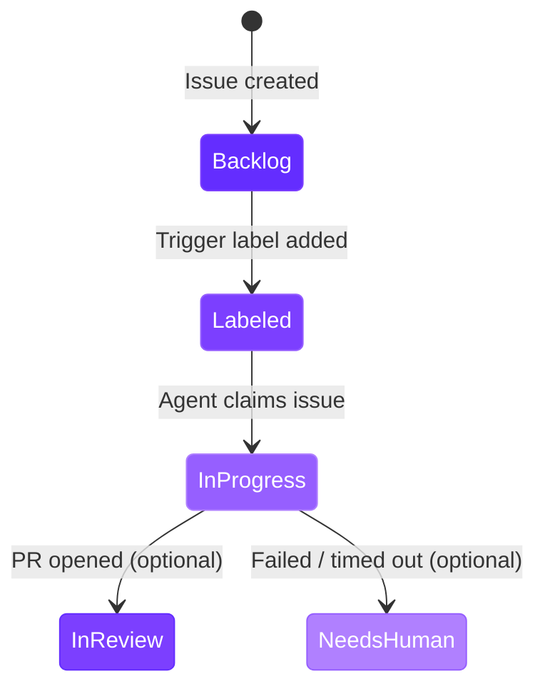

import RdePreviewWarning from "/snippets/rde-preview-warning.mdx";

<RdePreviewWarning />

## Overview

Autonomous agents are triggered by issues in your project tracker. When an issue is labeled with the configured trigger label, the system claims it, launches an agent workspace, and reports results back - including posting lifecycle comments and transitioning workflow states.

Linear is currently the supported project tracker. Jira and GitHub Issues integrations are planned.

## Connecting Linear

The Linear API token is configured in the portal admin settings. This token gives the system read/write access to your Linear workspace - it uses it to fetch issues, post comments, transition workflow states, and read team and label metadata.

The token must have access to:

- **Issues** - read and write (to fetch issue details and update state)
- **Comments** - write (to post lifecycle comments)
- **Labels** - read (to match trigger labels)
- **Workflow states** - read (to populate state dropdowns in blueprint configuration)
- **Teams** - read (to populate team dropdowns in blueprint configuration)

<Warning>
Without a valid Linear API token configured in the portal, agent blueprints cannot pick up issues. The background runner skips blueprints when the token is missing or invalid.
</Warning>

## How the Issue Flow Works

The following diagram shows the end-to-end flow from labeling an issue to receiving a pull request.

```mermaid
sequenceDiagram
    participant Dev as Developer
    participant Linear as Linear
    participant Runner as Background Runner
    participant DB as Database
    participant WS as Workspace

    Dev->>Linear: Labels issue with trigger label
    
    loop Every 60 seconds
        Runner->>Linear: Polls for issues with trigger label
    end

    Runner->>DB: Claims issue (atomic insert)
    Note over DB: UNIQUE constraint on<br/>(org_id, linear_issue_id)<br/>prevents duplicates

    Runner->>Linear: Transitions issue to In-Progress
    Runner->>Linear: Posts "claimed" comment
    Runner->>WS: Launches workspace with agent config

    WS->>WS: Agent works on the issue

    alt Success
        WS->>Runner: Callback with PR URL
        Runner->>Linear: Posts comment with PR URL
        Runner->>Linear: Transitions to In-Review state
    else Failure or Timeout
        WS->>Runner: Callback with error
        Runner->>Linear: Posts comment with failure reason
        Runner->>Linear: Transitions to Needs-Human state
    end

    Runner->>WS: Stops workspace

    style Dev fill:#642DFF,color:#fff
    style Linear fill:#7C3FFF,color:#fff
    style Runner fill:#965FFF,color:#fff
    style DB fill:#B080FF,color:#fff
    style WS fill:#7C3FFF,color:#fff
```

## Configuring Teams

Each agent blueprint monitors one Linear team. Only issues from the configured team are picked up by that blueprint.

The team dropdown in the blueprint settings lists all teams accessible via the configured API token. To monitor multiple teams, create separate agent blueprints - one per team.

| Blueprint Setting | Value |
|---|---|
| **Linear Team** | Required. The team whose issues the agent monitors. |

## Configuring the Trigger Label

The trigger label determines which issues within the configured team are picked up by the agent. Only issues that have both the correct team **and** the trigger label are candidates for a run.

| Blueprint Setting | Default | Description |
|---|---|---|
| **Issue Label** | `qovery-agent-ready` | The Linear label that triggers an agent run. |

The label dropdown in the blueprint settings lists all labels available in your Linear workspace. You can use any existing label or create a dedicated one.

<Tip>
Using a dedicated label like `qovery-agent-ready` keeps the trigger explicit. Avoid reusing labels that are applied automatically by other workflows, as this could trigger unintended agent runs.
</Tip>

## Workflow State Mapping

Agent blueprints map three Linear workflow states to key moments in the run lifecycle. These state transitions keep your Linear board in sync with agent activity.

### In-Progress State (required)

Set when the agent claims the issue. This signals to the team that work has started and prevents the issue from being picked up by another agent or assigned manually.

The blueprint cannot function without this state configured. If autonomous mode is enabled but no In-Progress state is set, the blueprint will not process issues.

### In-Review State (optional)

Set when the agent successfully opens a pull request. If not configured, the issue state is not changed on success - only a lifecycle comment with the PR URL is posted.

### Needs-Human State (optional)

Set when the agent fails or the run times out. If not configured, the issue state is not changed on failure - only a lifecycle comment with the failure reason is posted.



| State | Required | When Set | Fallback if Not Configured |
|---|---|---|---|
| **In-Progress** | Yes | Agent claims the issue | Blueprint will not process issues |
| **In-Review** | No | Agent opens a PR | Comment posted, state unchanged |
| **Needs-Human** | No | Agent fails or times out | Comment posted, state unchanged |

## Lifecycle Comments

The system posts comments on Linear issues at each stage of the run. These comments provide a real-time audit trail of agent activity directly in your project tracker.

All comments are posted by the **Qovery Autonomous Agent** bot identity (`autonomous-agent@qovery.com`).

| Event | Comment Content |
|---|---|
| **Issue claimed** | Agent has claimed the issue and is setting up a workspace. |
| **Workspace launched** | Workspace is running; agent is actively working on the issue. |
| **PR opened** | Agent completed the work. Includes a direct link to the pull request. |
| **Run failed** | Agent encountered an error. Includes the failure reason. |
| **Run timed out** | Run exceeded the configured timeout. Includes the failure reason. |
| **Stopped manually** | Administrator stopped the run via the portal ("Stopped via portal"). |
| **Retried** | Administrator retried the run. A new workspace will be launched. |
| **Deleted** | Administrator deleted the run via the portal ("Deleted via portal"). |

<Info>
Lifecycle comments are append-only. The system never edits or deletes previous comments, preserving a complete history of agent activity on each issue.
</Info>

## Concurrency and Timing

### Polling Interval

The background runner polls Linear every **60 seconds** for issues matching each blueprint's team and label criteria. There may be up to a one-minute delay between labeling an issue and the agent claiming it.

### Max Concurrent Runs

Each blueprint has a configurable concurrency cap (default: **3**). When the number of active runs (status `claimed`, `launching`, or `running`) reaches this limit, the runner skips that blueprint until a slot opens.

### Run Timeout

Each run has a maximum duration (default: **60 minutes**). When the timeout is reached, the workspace is stopped, the run status is set to `timed_out`, and a lifecycle comment is posted on the Linear issue. If a Needs-Human state is configured, the issue transitions to that state.

### Atomic Claiming

When the runner finds a matching issue, it inserts a claim record into the database. A UNIQUE constraint on `(org_id, linear_issue_id)` ensures that only one runner cycle can claim a given issue. If two cycles attempt to claim the same issue simultaneously, only one succeeds - the other is silently rejected.

## Duplicate Prevention

The system uses a database unique constraint on the combination of organization ID and Linear issue ID to prevent the same issue from being claimed twice. This guarantee holds even under concurrent polling cycles or manual run creation.

If a run for a given issue already exists (in any non-terminal status), the system will not create another run for that issue. Once a run reaches a terminal status (`pr_opened`, `failed`, `timed_out`, or `done`), the issue can be retried - but retries go through the existing run record rather than creating a new one.

## Future Integrations

<Info>
**Jira** and **GitHub Issues** integrations are planned. The agent blueprint configuration will be extended with additional project tracker options. If you need a specific integration, contact the Qovery team.
</Info>

## Next Steps

<CardGroup cols={3}>
  <Card title="Agent Blueprints" icon="cubes" href="/rde/agents/agent-blueprints">
    Configure blueprints that define how agents run, including runtimes, repositories, and resource limits.
  </Card>
  <Card title="Managing Runs" icon="list-check" href="/rde/agents/managing-runs">
    Monitor active runs, review results, and troubleshoot failures.
  </Card>
  <Card title="Getting Started" icon="play" href="/rde/agents/getting-started">
    Set up your first autonomous agent from scratch.
  </Card>
</CardGroup>
