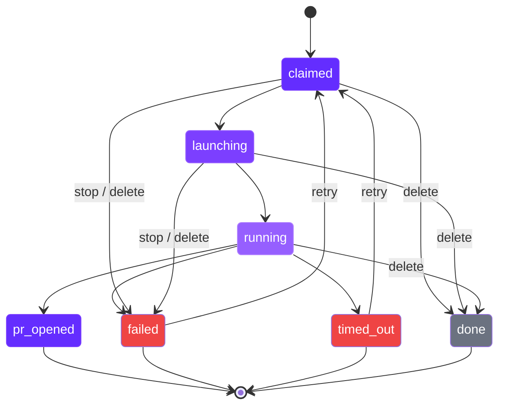

import RdePreviewWarning from "/snippets/rde-preview-warning.mdx";

<RdePreviewWarning />

## Overview

When a user triggers the agent on an issue that matches a blueprint - by @mentioning or assigning it in Linear, or by assigning it to the agent's user in Jira - the system creates a **run**. A run tracks the full lifecycle from issue claim to pull request creation (or failure). This page covers the admin dashboard, run lifecycle, and management actions available to administrators, and applies to both trackers.

## Run Statuses

Every run moves through a series of statuses that reflect its current stage.

| Status | Description |
|--------|-------------|
| `claimed` | Issue claimed on the tracker, workspace preparation started |
| `launching` | Workspace environment is deploying on your cluster |
| `running` | Agent is actively working on the issue |
| `pr_opened` | Agent completed successfully and opened a pull request. Workspace is kept alive briefly, then auto-deleted. |
| `failed` | Agent encountered an error or was stopped manually. Workspace environment is auto-deleted. |
| `timed_out` | Run exceeded the configured timeout. Workspace environment is auto-deleted. |
| `done` | Run was deleted by an admin |

## Agents Overview Dashboard

Navigate to **Admin > Agents > Overview** for a high-level view of all agent activity.

### Stats Bar

The top of the page displays aggregate counters:

- **Active** - runs currently in `claimed`, `launching`, or `running` status
- **Completed** - runs that reached `pr_opened`
- **Failed** - runs in `failed` status
- **Timed Out** - runs in `timed_out` status
- **Total** - all runs across all statuses

### Agent Topology Graph

Below the stats bar, a visual graph maps the relationship between clusters, blueprints, and individual runs.

- **Top level** - Kubernetes clusters where agents execute
- **Middle level** - agent blueprints deployed to each cluster
- **Bottom level** - individual run pills, color-coded by status

Click a run pill to view its detail page. Click a blueprint node to edit its settings.

Use the filter toggle to switch between **Active only** (default) and **All runs**.

### Recent Runs

A table at the bottom shows the latest 10 runs across all blueprints. The dashboard auto-refreshes every 30 seconds.

## Runs Dashboard

Navigate to **Admin > Agents > Runs** for the full runs table.

The table includes these columns:

| Column | Description |
|--------|-------------|
| Issue | Linear or Jira issue key, linked to the run detail page |
| Owner | Assigned owner email, with a fallback badge if applicable |
| Status | Current run status |
| PR | Link to the pull request (when available) |
| Started | Timestamp when the run was claimed |
| Updated | Last status change timestamp |
| Failure Reason | Error message for failed or timed-out runs |
| Actions | Dropdown with available management actions |

The table auto-refreshes every 30 seconds.

## Run Actions

Each run supports a set of actions based on its current status.

| Action | Available When | Effect |
|--------|---------------|--------|
| **Stop** | `claimed`, `launching`, `running` | Stops the workspace, marks the run as `failed` with reason "Stopped via portal", and posts a comment on the issue |
| **Restart** | `running` (with active workspace) | Restarts the workspace environment and posts a comment on the issue |
| **Retry** | `failed`, `timed_out` | Resets the run, re-claims the issue, and launches a new workspace |
| **Delete** | `claimed`, `launching`, `running` | Stops the workspace, marks the run as `done` with reason "Deleted via portal", and posts a comment on the issue |
| **View Workspace** | Any run with an active workspace | Opens the workspace in the portal |

<Info>
All actions that modify a run are reflected on the issue as lifecycle comments (and status transitions where configured). This keeps your project tracker in sync with agent activity.
</Info>

## Run Detail Page

View detailed information for a single run at **Admin > Agents > Runs > [Run]**.

The detail page shows:

- **Issue title and description** - the full context the agent is working from
- **Status** - current run status with timestamps
- **Owner** - assigned owner, with a dropdown to reassign
- **PR URL** - link to the pull request (when available)
- **Timestamps** - when the run was claimed and last updated

Quick links at the top provide direct access to:

- **Workspace** - open the agent's workspace in the portal
- **Qovery Console** - view the underlying environment in the Qovery dashboard
- **Issue** - jump to the issue in Linear or Jira

<Tip>
When a run is assigned to the system fallback account, a **fallback** badge appears next to the owner. This indicates no human assignee was found on the issue.
</Tip>

## Creating a Run Manually

You can trigger a run manually without @mentioning the agent in Linear.

<Info>
Manual run creation currently searches Linear issues only. For Jira, trigger runs by assigning the issue to the agent's Jira user.
</Info>

<Steps>
  <Step title="Open the Create dialog">
    Navigate to **Admin > Agents > Runs** and click **Create**.
  </Step>

  <Step title="Search for a Linear issue">
    Type a Linear issue title or identifier (e.g., `ENG-142`) to search. Select the issue you want the agent to work on.
  </Step>

  <Step title="Select a blueprint">
    The portal auto-matches an agent blueprint based on the issue's team. You can override the selection if multiple blueprints are available.
  </Step>

  <Step title="Assign an owner (optional)">
    Select an organization member as the run owner. If left empty, the system uses the Linear issue assignee or falls back to the system account.
  </Step>

  <Step title="Submit">
    Click **Create**. The system validates that the selected blueprint has autonomous mode enabled and the claimed state is configured, then launches the run.
  </Step>
</Steps>

<Warning>
Manual run creation requires a blueprint with autonomous mode enabled and a configured claimed workflow state. If either is missing, the creation will fail with a validation error.
</Warning>

## Owner Assignment

Runs are assigned an owner based on the following logic:

1. **Issue assignee** - the email of the person assigned to the issue is used by default.
2. **System fallback** - if the issue has no assignee, the run is assigned to `autonomous-agent@qovery.com` and marked with `owner_fallback = true`. A **fallback** badge appears in the UI.
3. **Admin reassignment** - administrators can change the owner from the run detail page using the owner dropdown.

## My Runs (User View)

Users can view their assigned runs from their personal dashboard. The **My Runs** view shows the latest 50 runs assigned to the authenticated user, including:

- Run status
- Linear or Jira issue link
- Pull request link (when available)
- Timestamps

This view is read-only. Management actions (stop, restart, retry, delete) are only available from the admin dashboard.

## Next Steps

<CardGroup cols={3}>
  <Card title="Agent Blueprints" icon="cubes" href="/rde/agents/agent-blueprints">
    Configure blueprints that define how agents run, including runtimes, repositories, and resource limits.
  </Card>
  <Card title="Linear Integration" icon="arrows-rotate" href="/rde/agents/linear-integration">
    Set up the OAuth connection, issue flow, and workflow state mapping.
  </Card>
  <Card title="Troubleshooting" icon="wrench" href="/rde/reference/troubleshooting">
    Diagnose and resolve common agent failures.
  </Card>
</CardGroup>
