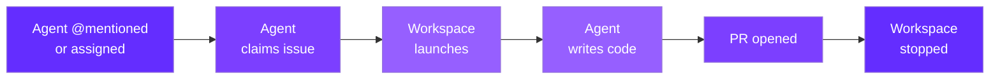

import RdePreviewWarning from "/snippets/rde-preview-warning.mdx";

<RdePreviewWarning />

Autonomous agents pick up issues from your project tracker, work on them in isolated cloud environments, and open pull requests - without human intervention. They use the same blueprint and governance infrastructure as workspaces, but operate autonomously.

Linear is currently supported as the project tracker. Jira and GitHub Issues integrations are planned.

## How It Works

When a user @mentions or assigns the agent on a Linear issue, the agent claims it instantly, launches a workspace, writes the code, opens a pull request, and shuts down. Progress is streamed back to Linear in real time.

## Agents vs Workspaces

Autonomous agents and workspaces share the same underlying infrastructure but serve different workflows.

| | Workspaces | Autonomous Agents |
|---|---|---|
| **Trigger** | Human clicks "Create" | Agent @mentioned or assigned on issue |
| **Interaction** | Human works in browser | AI agent runs autonomously |
| **Output** | Running application | Pull request |
| **Lifecycle** | Manual start/stop | Auto-launch, auto-stop on completion |
| **Blueprint type** | Workspace Blueprint | Agent Blueprint |
| **Admin view** | Workspace Management | Agents Dashboard & Runs |

## Supported Runtimes

Each agent blueprint specifies which AI coding runtime to use. The runtime determines the CLI tool that drives the agent inside the workspace.

<CardGroup cols={3}>
  <Card title="Claude Code" icon="terminal">
    Anthropic's coding agent. Runs `claude -p` with the issue description as the prompt.
  </Card>
  <Card title="OpenCode" icon="code">
    Open-source coding agent. Runs `opencode run` to process the issue autonomously.
  </Card>
  <Card title="Codex" icon="microchip">
    OpenAI's coding agent. Runs `codex --full-auto` for fully autonomous operation.
  </Card>
  <Card title="Gemini CLI" icon="gem">
    Google's coding agent. Runs `gemini -p` with the issue context as input.
  </Card>
  <Card title="Cursor CLI" icon="arrow-pointer">
    Cursor's agent mode. Runs `cursor-agent` to resolve the issue.
  </Card>
</CardGroup>

## Shared Infrastructure

Autonomous agents run on the same Kubernetes cluster as workspaces. They use the same split architecture - the portal orchestrates agent runs from `rde.qovery.com`, while the agent containers execute on your infrastructure. The same security model applies: no inbound ports, outbound-only TLS/gRPC tunnels, and all code stays on your cluster.

For details on the underlying infrastructure, see [Architecture](/rde/reference/architecture) and [Security & Data Residency](/rde/reference/security).

## Supported Project Trackers

**Linear** is the currently supported project tracker. You connect your Linear workspace via OAuth, and your team triggers agents by @mentioning or assigning them on issues. The agent responds instantly with a real-time plan and progress updates visible directly in Linear.

<Info>
**Jira** and **GitHub Issues** integrations are planned. If you need a specific integration, contact the Qovery team.
</Info>

## Next Steps

<CardGroup cols={2}>
  <Card title="Getting Started" icon="play" href="/rde/agents/getting-started">
    Set up your first autonomous agent with Linear integration.
  </Card>
  <Card title="Agent Blueprints" icon="cubes" href="/rde/agents/agent-blueprints">
    Configure blueprints that define how agents run.
  </Card>
  <Card title="Managing Runs" icon="list-check" href="/rde/agents/managing-runs">
    Monitor agent runs, review results, and troubleshoot failures.
  </Card>
  <Card title="Linear Integration" icon="link" href="/rde/agents/linear-integration">
    Connect Linear, configure labels, and manage issue routing.
  </Card>
</CardGroup>
