<Warning>
**Preview**: Remote Dev Environments Portal is currently in preview. Features and capabilities are under active development and may change.
</Warning>

<Info>
Looking for the CLI-based approach? See [Remote Development Environments with the CLI](/getting-started/guides/use-cases/remote-development-environments) for managing RDEs via `qovery rde` commands.
</Info>

## Overview

The Remote Dev Environments (RDE) Portal is a **self-service web application** deployed on your own Qovery infrastructure. It lets platform engineers define blueprint environments and gives builders — engineers and non-technical team members alike — the ability to create their own isolated cloud workspaces with one click.

The portal includes a **built-in terminal with Claude Code and OpenCode chat** for AI-assisted development, **live app preview** with viewport switching, **publish workflows** for deploying to production, and **git snapshots** for versioning your work. Authentication is handled through SSO via your Qovery organization.

## Two Approaches to RDE

<CardGroup cols={2}>
  <Card title="CLI-Based Management" icon="terminal" href="/getting-started/guides/use-cases/remote-development-environments">
    **Available Now** — Platform engineers use `qovery rde` CLI commands for full control over environment provisioning, lifecycle management, and user access. Best for teams that want programmatic or automated RDE workflows.
  </Card>
  <Card title="Self-Service Portal" icon="browser">
    **Preview** — A web-based UI where builders create environments themselves. No CLI, no Kubernetes knowledge needed. Platform engineers configure blueprints and access control; builders do the rest. This is what this documentation section covers.
  </Card>
</CardGroup>

## Key Capabilities

<CardGroup cols={3}>
  <Card title="One-Click Workspaces" icon="mouse-pointer">
    Builders pick a blueprint, click Create, and get a fully configured development environment running on your infrastructure.
  </Card>
  <Card title="Built-in AI Tools" icon="robot">
    Every workspace includes a terminal with Claude Code and an OpenCode chat panel, preconfigured and ready to use.
  </Card>
  <Card title="Live Preview" icon="eye">
    See your running application directly in the browser with viewport switching for desktop, tablet, and mobile.
  </Card>
  <Card title="Publish to Production" icon="rocket">
    Submit deployment requests with subdomain selection. Admins review and approve before the app goes live.
  </Card>
  <Card title="Blueprint Access Control" icon="shield-halved">
    Restrict which blueprints are available to which users — by email address, email domain, or open to everyone.
  </Card>
  <Card title="Portal Customization" icon="palette">
    Custom branding with your logo, colors, and portal name. Configure the welcome screen and per-blueprint layout settings.
  </Card>
</CardGroup>

## Secure by Design

The RDE Portal runs **entirely on your own infrastructure**. Every workspace container, terminal session, AI interaction, and application preview stays on your Kubernetes cluster — nothing leaves your environment.

<CardGroup cols={2}>
  <Card title="Your Infrastructure, Your Data" icon="server">
    The portal, the database, and every workspace container run on your Qovery-managed Kubernetes cluster. Source code, AI conversations, and application data never leave your infrastructure. The portal only stores configuration (ACL rules, theme settings) — never your code.
  </Card>
  <Card title="Streamed, Not Stored" icon="signal-stream">
    Terminal sessions and application previews are **streamed in real time** from your containers to the browser. The portal relays data without persisting it. When a session ends, nothing is recorded by the portal.
  </Card>
</CardGroup>

<CardGroup cols={2}>
  <Card title="Full Admin Control" icon="lock">
    Platform engineers control everything: blueprint definitions, access control rules, workspace limits, publish approvals, and AI provider configuration. Users can only access what admins explicitly allow.
  </Card>
  <Card title="Compliance Inherited" icon="shield-check">
    Because the portal runs on your existing cluster, it inherits your compliance posture. If your cluster is SOC 2, HIPAA, GDPR, or DORA compliant, your workspaces are too — no additional certification needed.
  </Card>
</CardGroup>

<Info>
For a detailed breakdown of the security architecture, streaming model, token management, and network security, see the [Security & Data Residency](/rde/reference/security) page.
</Info>

## How It Works

The portal follows a clear separation between **admin configuration** and **builder usage**. Admins set up the portal and register blueprints with access controls. Builders log in, create workspaces from available blueprints, develop with the built-in tools, and publish their applications.

```mermaid
flowchart LR
    A[Admin configures portal] --> B[Admin registers blueprints]
    B --> C[Admin sets ACLs]
    C --> D[Builder logs in]
    D --> E[Builder creates workspace]
    E --> F[Builder develops with terminal & chat]
    F --> G[Builder publishes app]

    style A fill:#642DFF,color:#fff
    style B fill:#642DFF,color:#fff
    style C fill:#642DFF,color:#fff
    style D fill:#642DFF,color:#fff
    style E fill:#642DFF,color:#fff
    style F fill:#642DFF,color:#fff
    style G fill:#642DFF,color:#fff
```

## Who Is This For?

<CardGroup cols={2}>
  <Card title="Platform Engineers / Admins" icon="server">
    **You set up and control the portal.**

    - Deploy and configure the RDE Portal on your Qovery infrastructure
    - Register blueprint environments from existing Qovery projects
    - Configure access control rules per blueprint
    - Manage active workspaces and approve publish requests
    - Customize portal branding and layout
  </Card>
  <Card title="Builders / Developers" icon="hammer">
    **You build and ship applications.**

    - Create workspaces from available blueprints with one click
    - Use the built-in terminal with Claude Code for AI-assisted coding
    - Chat with OpenCode directly in the workspace
    - Preview your running application in the browser
    - Publish your app to production with subdomain selection
  </Card>
</CardGroup>

## Prerequisites

Before setting up the RDE Portal, make sure you have:

- An **active Qovery account** with a running Kubernetes cluster
- At least one **Qovery project and environment** to use as a blueprint template
- **Organization admin access** for initial portal setup

<Note>
The RDE Portal itself is deployed as an application on your Qovery infrastructure. It runs within your cluster alongside your other services.
</Note>

## Getting Started

<CardGroup cols={2}>
  <Card title="Admin Setup" icon="gear" href="/rde/getting-started/admin-setup">
    Configure your portal, register blueprints, and set up access control.
  </Card>
  <Card title="Create Your First Workspace" icon="plus" href="/rde/getting-started/create-your-first-workspace">
    Spin up your first development environment in minutes.
  </Card>
</CardGroup>

## Explore

<CardGroup cols={2}>
  <Card title="For Admins" icon="sliders" href="/rde/admin/blueprint-management">
    Manage blueprints, users, and portal settings.
  </Card>
  <Card title="For Users" icon="laptop-code" href="/rde/user/workspace-dashboard">
    Learn to use the workspace dashboard and editor.
  </Card>
  <Card title="Security & Data Residency" icon="shield-check" href="/rde/reference/security">
    How the portal keeps your data on your infrastructure.
  </Card>
  <Card title="Architecture" icon="sitemap" href="/rde/reference/architecture">
    Understand how the portal works under the hood.
  </Card>
</CardGroup>
