<Warning>
**Preview**: Remote Dev Environments Portal is currently in preview. Features and capabilities are under active development and may change.
</Warning>

<Note>
**Plan requirement**: The RDE Portal is available as an add-on on the **Business** and **Enterprise** plans. See [Qovery Pricing](https://www.qovery.com/pricing) for details.
</Note>

<Info>
Looking for the CLI-based approach? See [Remote Development Environments with the CLI](/getting-started/guides/use-cases/remote-development-environments) for managing RDEs via `qovery rde` commands.
</Info>

## Why Remote Dev Environments?

AI coding tools have turned non-technical employees into builders. Finance analysts, sales ops leads, product managers, even executives - are using tools like Lovable, Bolt.new, and Replit to build and deploy applications with company data. No ticket filed. No IT approval. No one asking where the data goes.

Consider the example: your finance analyst builds a retention analysis tool connected to your production database on Lovable. She didn't know she needed to ask IT. She just described what she wanted and the AI built it. The tool is live, connected to sensitive data, running on shared infrastructure you don't control - and your security team has zero visibility into it.

This is shadow IT. Not the spreadsheet macros of the past - deployed web applications with database access, API keys in vendor-managed servers, and no audit trail. Every one of these apps is a compliance surface your CISO can't see.

<CardGroup cols={2}>
  <Card title="The Problem" icon="triangle-exclamation">
    On external platforms, your code, API keys, and data live on shared infrastructure you don't control. No VPC peering, no private networking, no meaningful audit trail. In regulated industries - finance, healthcare, legal - this creates compliance gaps that certifications alone can't close.
  </Card>
  <Card title="The Solution" icon="shield-check">
    The RDE Portal provides the same one-click builder experience - but on your own infrastructure, under your control. SSO, pre-configured blueprints, workspace isolation, publish approvals, full audit trails. **Secure by architecture, not by policy.**
  </Card>
</CardGroup>

Banning AI builder tools doesn't work. The business value is too real. The answer is to provide a governed platform that builders actually want to use - where the official path is faster and easier than the workaround.

<Info>
For a full analysis of the enterprise risks of Lovable, Bolt.new, and Replit, read [Lovable, Bolt, and Replit Are Wonderful - Until Your CISO Finds Out](https://www.qovery.com/blog/lovable-bolt-replit-enterprise-limitations).
</Info>

## Overview

The Remote Dev Environments (RDE) Portal is a **self-service web application** accessible at [rde.qovery.com](https://rde.qovery.com). It lets platform engineers define blueprint environments and gives builders - engineers and non-technical team members alike - the ability to create their own isolated cloud workspaces with one click. Just log in with your Qovery account to get started.

The portal includes a **built-in terminal with Claude Code and OpenCode chat** for AI-assisted development, **live app preview** with viewport switching, **publish workflows** for deploying to production, and **git snapshots** for versioning your work. Authentication is handled through your existing Qovery account - no additional signup required.

## Two Approaches to RDE

<CardGroup cols={2}>
  <Card title="CLI-Based Management" icon="terminal" href="/getting-started/guides/use-cases/remote-development-environments">
    **Available Now** - Platform engineers use `qovery rde` CLI commands for full control over environment provisioning, lifecycle management, and user access. Best for teams that want programmatic or automated RDE workflows.
  </Card>
  <Card title="Self-Service Portal" icon="browser" href="https://rde.qovery.com">
    **Preview** - A web-based UI at [rde.qovery.com](https://rde.qovery.com) where builders create environments themselves. No CLI, no Kubernetes knowledge needed. Requires a **Business** or **Enterprise** plan. This is what this documentation section covers.
  </Card>
</CardGroup>

## Key Capabilities

<CardGroup cols={3}>
  <Card title="One-Click Workspaces" icon="mouse-pointer">
    Builders pick a blueprint, click Create, and get a fully configured development environment running on your infrastructure.
  </Card>
  <Card title="Built-in AI Tools" icon="robot">
    Every workspace includes a terminal with Claude Code and an OpenCode chat panel, preconfigured and ready to use.
  </Card>
  <Card title="Live Preview" icon="eye">
    See your running application directly in the browser with viewport switching for desktop, tablet, and mobile.
  </Card>
  <Card title="Publish to Production" icon="rocket">
    Submit deployment requests with subdomain selection. Admins review and approve before the app goes live.
  </Card>
  <Card title="Blueprint Access Control" icon="shield-halved">
    Restrict which blueprints are available to which users - by email address, email domain, or open to everyone.
  </Card>
  <Card title="Portal Customization" icon="palette">
    Custom branding with your logo, colors, and portal name. Configure the welcome screen and per-blueprint layout settings.
  </Card>
</CardGroup>

## Secure by Design

The RDE Portal uses a **split architecture** - the portal itself (UI and API) is hosted by Qovery at `rde.qovery.com`, while your **workspace containers run entirely on your own Kubernetes cluster**. Your cluster is never exposed to the internet - Qovery agents on your cluster initiate all connections outbound via TLS/gRPC.

<CardGroup cols={2}>
  <Card title="Your Code Stays on Your Infrastructure" icon="server">
    Workspace containers run on your Qovery-managed Kubernetes cluster. Source code, AI conversations, and application data never leave your infrastructure. The portal orchestrates workspaces but never stores your code.
  </Card>
  <Card title="No Inbound Ports" icon="shield-halved">
    Your cluster is never exposed to the internet. Qovery agents on your cluster initiate **outbound** TLS/gRPC connections to the control plane. All traffic - terminal sessions, previews, deployments - flows through this cluster-initiated tunnel.
  </Card>
</CardGroup>

<CardGroup cols={2}>
  <Card title="Streamed, Not Stored" icon="signal-stream">
    Terminal sessions and application previews are **streamed in real time** from your containers through the cluster-initiated tunnel to the browser. The portal relays data without persisting it. When a session ends, nothing is recorded.
  </Card>
  <Card title="Full Admin Control" icon="lock">
    Platform engineers control everything: blueprint definitions, access control rules, workspace limits, publish approvals, and AI provider configuration. Workspace containers inherit your cluster's compliance posture (SOC 2, HIPAA, GDPR, DORA).
  </Card>
</CardGroup>

<Info>
For a detailed breakdown of the security architecture, streaming model, token management, and network security, see the [Security & Data Residency](/rde/reference/security) page.
</Info>

## How It Works

The portal follows a clear separation between **admin configuration** and **builder usage**. Admins set up the portal and register blueprints with access controls. Builders log in, create workspaces from available blueprints, develop with the built-in tools, and publish their applications.

```mermaid
flowchart LR
    A[Admin configures portal] --> B[Admin registers blueprints]
    B --> C[Admin sets ACLs]
    C --> D[Builder logs in]
    D --> E[Builder creates workspace]
    E --> F[Builder develops with terminal & chat]
    F --> G[Builder publishes app]

    style A fill:#642DFF,color:#fff
    style B fill:#642DFF,color:#fff
    style C fill:#642DFF,color:#fff
    style D fill:#642DFF,color:#fff
    style E fill:#642DFF,color:#fff
    style F fill:#642DFF,color:#fff
    style G fill:#642DFF,color:#fff
```

## What Is a Blueprint?

A **blueprint** is a pre-configured workspace template created by your platform team. Think of it as a ready-to-use work environment - the right tools, the right database connections, the right API credentials - all set up and secured. Builders don't configure anything. They pick a blueprint, click Create, and start building.

The platform team controls what each blueprint can access: which databases, which internal APIs, which credentials. That governance is invisible to the builder. From their perspective, they just pick a template and get to work.

Different teams get different blueprints, scoped to what they actually need:

<CardGroup cols={2}>
  <Card title="Finance Blueprint" icon="chart-line">
    Pre-connected to the analytics database. Right tools, right access. A finance analyst can build a retention dashboard without ever touching a config file - or accidentally connecting to the wrong database.
  </Card>
  <Card title="Sales Blueprint" icon="handshake">
    Pre-configured with CRM credentials and the internal pipeline API. Sales ops builds their own reporting tools without filing a ticket or waiting weeks for engineering bandwidth.
  </Card>
  <Card title="Marketing Blueprint" icon="megaphone">
    Connected to the content management API and the analytics stack. Marketing builds campaign tools and data views without infrastructure access.
  </Card>
  <Card title="Engineering Blueprint" icon="code">
    Full-stack development environment with databases, services, and all the tools engineers need. The same isolated, reproducible setup for every developer on the team.
  </Card>
</CardGroup>

Each workspace is an isolated clone of the blueprint. One builder's workspace cannot affect another's. Admins see every workspace, every operation, and every publish request across the organization. No shadow IT - because the official platform is faster than the workaround.

## Who Is This For?

<CardGroup cols={2}>
  <Card title="Platform Engineers / Admins" icon="server">
    **You set up and control the portal.**

    - Configure your organization on [rde.qovery.com](https://rde.qovery.com)
    - Register blueprint environments from existing Qovery projects
    - Configure access control rules per blueprint
    - Manage active workspaces and approve publish requests
    - Customize portal branding and layout
  </Card>
  <Card title="Builders / Developers" icon="hammer">
    **You build and ship applications.**

    - Create workspaces from available blueprints with one click
    - Use the built-in terminal with Claude Code for AI-assisted coding
    - Chat with OpenCode directly in the workspace
    - Preview your running application in the browser
    - Publish your app to production with subdomain selection
  </Card>
</CardGroup>

## Prerequisites

Before using the RDE Portal, make sure you have:

- An **active Qovery account** on a **Business** or **Enterprise** plan with the **RDE Portal add-on** enabled - see [Pricing](https://www.qovery.com/pricing)
- A **running Kubernetes cluster** on Qovery
- At least one **Qovery project and environment** to use as a blueprint template
- **Organization admin access** for initial portal configuration

## Getting Started

<CardGroup cols={2}>
  <Card title="Admin Setup" icon="gear" href="/rde/getting-started/admin-setup">
    Configure your portal, register blueprints, and set up access control.
  </Card>
  <Card title="Create Your First Workspace" icon="plus" href="/rde/getting-started/create-your-first-workspace">
    Spin up your first development environment in minutes.
  </Card>
</CardGroup>

## Explore

<CardGroup cols={2}>
  <Card title="For Admins" icon="sliders" href="/rde/admin/blueprint-management">
    Manage blueprints, users, and portal settings.
  </Card>
  <Card title="For Users" icon="laptop-code" href="/rde/user/workspace-dashboard">
    Learn to use the workspace dashboard and editor.
  </Card>
  <Card title="Security & Data Residency" icon="shield-check" href="/rde/reference/security">
    How the portal keeps your data on your infrastructure.
  </Card>
  <Card title="Architecture" icon="sitemap" href="/rde/reference/architecture">
    Understand how the portal works under the hood.
  </Card>
</CardGroup>
