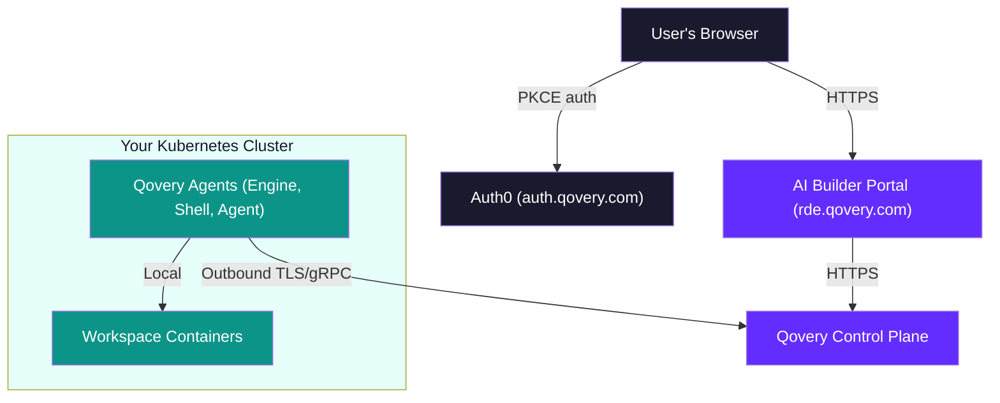
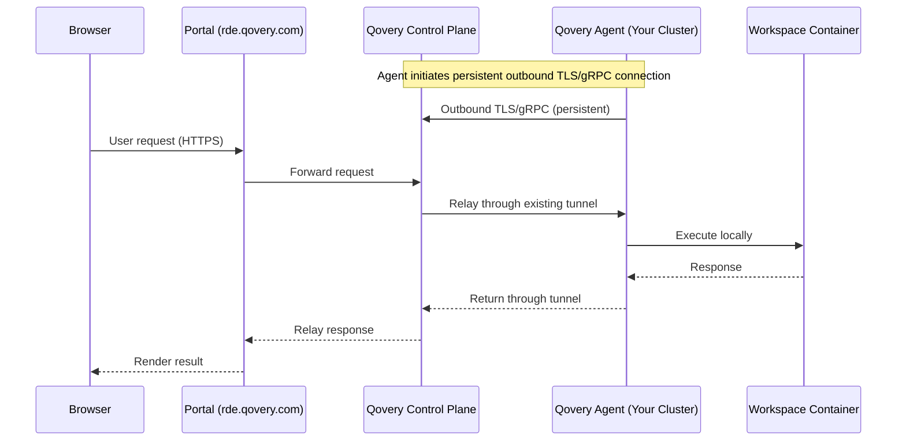
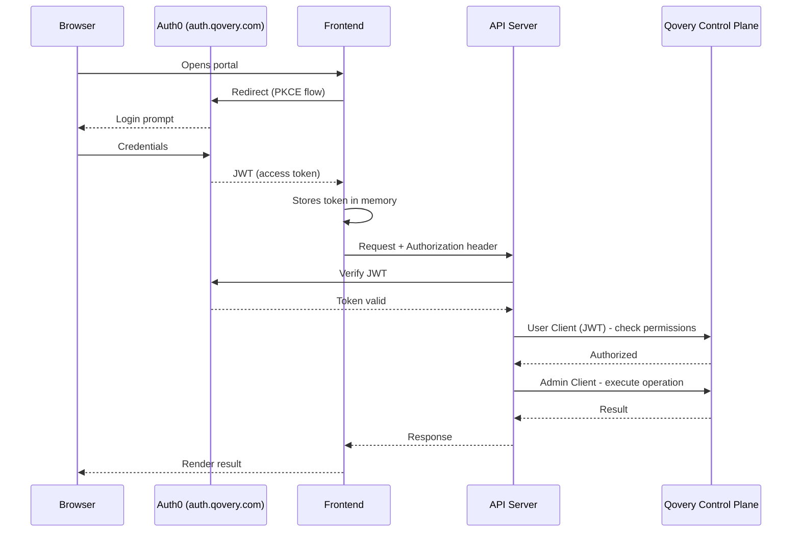
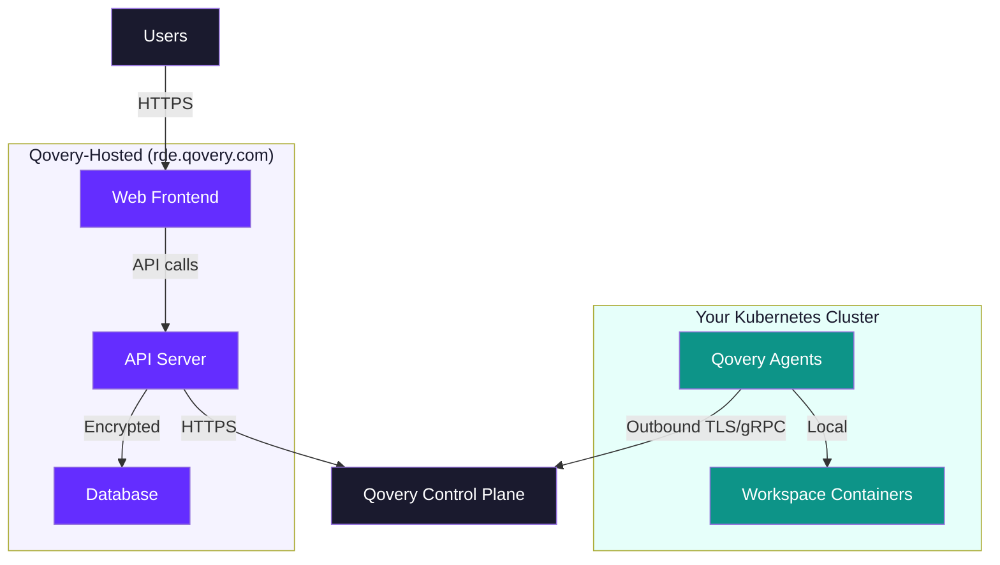

<Warning>
**Preview**: AI Builder Portal is in preview. Architecture details may change as the product evolves.
</Warning>

## Overview

The AI Builder Portal is a web application hosted by Qovery at [rde.qovery.com](https://rde.qovery.com). It consists of three components: a **web frontend**, an **API server** (Backend-for-Frontend), and a **database** - all managed by Qovery. The portal orchestrates workspace containers that run on **your** Kubernetes cluster.

A critical design principle: **your cluster is never exposed to the internet**. Qovery agents running on your cluster initiate all connections outbound to the Qovery control plane via TLS/gRPC. The control plane never connects inbound to your infrastructure.

This page explains the architecture, connectivity model, and data flow. For security-specific details - data residency, token management, and compliance - see the dedicated [Security & Data Residency](/rde/reference/security) page.

## High-Level Architecture

**Key:** All arrows from your cluster point **outbound**. Your cluster initiates connections to the Qovery control plane - not the other way around. No inbound ports are required on your infrastructure.

## Cluster Connectivity Model

This is the foundation of the AI Builder Portal's security architecture.

Your Kubernetes cluster runs **Qovery agents** - Engine, Shell agent, and other components - that maintain persistent **outbound TLS/gRPC connections** to the Qovery control plane. Your cluster never exposes inbound ports to the internet.

All portal operations flow through this cluster-initiated tunnel:

1. **Qovery agents on your cluster** establish and maintain outbound TLS/gRPC connections to the Qovery control plane. This is the only external communication from your cluster.
2. **The portal** sends requests to the Qovery control plane (same Qovery infrastructure).
3. **The control plane** relays the request through the already-established tunnel to the agent on your cluster.
4. **The agent** executes the operation locally - shell session, port forward, deployment - and returns the result through the same tunnel.

<Note>
Your infrastructure is never directly addressable from the internet. The Qovery agents on your cluster are the only components that communicate externally, and they only make **outbound** connections.
</Note>

## Components

### Web Frontend

The frontend renders the workspace dashboard, editor, and admin panels. It handles user authentication and opens secure connections for terminal sessions and live previews.

The frontend never communicates directly with the Qovery API or your cluster. All requests go through the API server.

### API Server (Backend-for-Frontend)

The API server acts as the gateway between the frontend and Qovery services. It handles:

- **Authentication** - Verifies JWTs on every request
- **Authorization** - Enforces blueprint ACLs, workspace ownership, and admin role checks
- **API proxying** - Translates portal operations into Qovery API calls using the [two-client model](#two-client-model)
- **Streaming relay** - Bridges terminal sessions and port-forward connections between the browser and Qovery's control plane
- **Business logic** - Publish workflows, blueprint discovery, catalog assembly, workspace lifecycle management

### Database

A database that stores portal-specific configuration. It does **not** store any user code, workspace data, or AI conversations.

The database holds:
- Organization settings (encrypted admin token, branding, limits)
- Blueprint access control rules
- Blueprint display configuration
- Publish workflow state (requests, approvals, trust rules)
- Member role assignments
- User tags and workspace tag assignments
- One-time authentication tickets for secure sessions
- Connection audit logs (shell and preview session history)
- IP firewall rules and blocked connection events

<Note>
The database does **not** store workspace state. Workspace lifecycle (running, stopped, deploying, error) and configuration are managed entirely through the Qovery API.
</Note>

### Qovery Control Plane

The portal communicates with the Qovery control plane for all resource management: listing projects, cloning environments, deploying services, managing members, and reading deployment status. The control plane in turn communicates with your cluster through the agent-initiated tunnel.

The control plane also provides:

- **Shell exec** - Interactive terminal sessions relayed through the agent to containers on your cluster
- **Port forwarding** - TCP tunnels relayed through the agent to container ports, used for live preview

## Authentication Flow

Users authenticate through **Auth0 (auth.qovery.com)** using the PKCE authorization code flow - the same authentication used by the Qovery Console.

On every request, the JWT is verified to determine the user's identity and permissions before any operation is executed.

## Two-Client Model

The API server maintains **two Qovery API clients** for each authenticated request:

<CardGroup cols={2}>
  <Card title="User Client" icon="user">
    Uses the **user's JWT** to call the Qovery API. This verifies that the user has the required RBAC permissions for the requested operation. If the user lacks permissions, the request is rejected before any action is taken.
  </Card>
  <Card title="Admin Client" icon="shield-halved">
    Uses an **organization admin API token** (automatically provisioned when the admin clicks **Configure Portal**) to execute privileged operations. This token enables the portal to clone environments, deploy workspaces, and manage lifecycle - operations that individual users may not have direct permissions for.
  </Card>
</CardGroup>

**Why two clients?** The portal needs to perform operations on behalf of users that those users may not have direct Qovery RBAC permissions for. For example, cloning a blueprint environment into a new project requires admin-level access. The two-client model separates **authorization** (verified via the user's JWT) from **execution** (performed via the admin token).

<Warning>
The admin API token is encrypted with **AES-256-GCM** and stored in the database. It is never exposed to the frontend or included in any API response. Only the API server can decrypt and use it.
</Warning>

## Convention-Based Discovery

The portal does **not** maintain a separate database of workspaces. Instead, it discovers workspaces through metadata tags stored on each Qovery environment.

When the portal needs to list a user's workspaces, it:

1. Queries the Qovery API for environments in the organization
2. Reads the metadata tags on each environment
3. Filters for environments that contain the RDE metadata
4. Matches workspaces to the current user by owner email

**Key metadata tags:**

| Tag | Purpose |
|-----|---------|
| `BLUEPRINT_PROJECT_ID` | Links the workspace to its source blueprint project |
| `BLUEPRINT_KEY` | Identifies the specific blueprint used to create the workspace |
| `RDE_OWNER_EMAIL` | Email address of the user who owns the workspace |
| `RDE_DISPLAY_NAME` | User-friendly name shown in the dashboard |

<Tip>
Because Qovery's API is the single source of truth, there are no sync issues between the portal and Qovery. If you modify a workspace directly in the Qovery Console, the portal reflects the change automatically.
</Tip>

<Info>
The portal supports **multi-cluster** organizations. Admins can assign specific Kubernetes clusters to specific blueprints via the [Target Cluster](/rde/admin/blueprint-management#target-cluster) setting. Workspace discovery spans all clusters in the organization.
</Info>

## Terminal & Preview

### Terminal (Shell Exec)

The portal provides interactive terminal sessions that connect to containers running in your Kubernetes cluster - without exposing your cluster to the internet.

**Connection flow:**

1. The frontend requests a **shell ticket** - a one-time token with a 30-second TTL
2. The frontend opens a secure connection to the API server, passing the shell ticket for authentication
3. The API server validates the ticket (single-use, not expired) and sends the request to the Qovery control plane
4. The control plane relays the session through the **cluster-initiated tunnel** to the Qovery Shell agent on your cluster
5. The Shell agent connects to the workspace container **locally** and streams the terminal session
6. Keystrokes and terminal output are relayed bidirectionally through the entire chain in real time

<Info>
Shell tickets are one-time tokens that expire after 30 seconds. This prevents bearer tokens from appearing in connection URLs, which could be logged by proxies or load balancers.
</Info>

### Live Preview (Port Forward)

The preview panel renders the user's running application in an iframe **without requiring a public URL or ingress configuration**.

**How it works:**

1. The frontend sends HTTP requests to the API server's preview endpoint
2. The API server forwards the request to the Qovery control plane
3. The control plane relays the request through the **cluster-initiated tunnel** to the Qovery agent on your cluster
4. The agent forwards the request to the workspace container's application port **locally**
5. The response is relayed back through the same tunnel to the browser

Workspaces do not need public domains, load balancers, or ingress rules for development previews. Your cluster is never exposed.

## Deployment Architecture

The AI Builder Portal uses a **split deployment model**: the portal is hosted by Qovery as a managed service at `rde.qovery.com`, while workspace containers run on your Kubernetes cluster.

| Component | Hosted by | Details |
|-----------|-----------|---------|
| **Web Frontend** | Qovery | Serves the portal UI |
| **API Server** | Qovery | Handles auth, API proxying, streaming relay, business logic |
| **Database** | Qovery | Stores portal configuration (ACLs, theme, publish state) - no user code |
| **Qovery Agents** | Your cluster | Maintain outbound TLS/gRPC tunnel to the control plane |
| **Workspace Containers** | Your cluster | Isolated environments where development happens |

You do not need to deploy or maintain the portal infrastructure - Qovery handles updates, availability, and scaling. You only manage your Kubernetes cluster where workspaces run.

## Data Model

The portal splits data storage between its database and the Qovery API:

| Data | Storage |
|------|---------|
| Workspace state (running/stopped) | Qovery API |
| Workspace metadata (owner, name) | Qovery environment metadata |
| Service logs and events | Qovery API |
| Blueprint access control rules | Portal database |
| Publish requests and trust rules | Portal database |
| Theme and branding | Portal database |
| Member roles | Portal database |
| User tags | Portal database |
| Connection audit logs | Portal database |
| Firewall rules and events | Portal database |

<Note>
No source code, AI conversations, or application data is stored in the portal database. All development data lives exclusively in workspace containers on your cluster.
</Note>

## Next Steps

<CardGroup cols={2}>
  <Card title="Security & Data Residency" icon="shield-check" href="/rde/reference/security">
    How the portal keeps your data on your infrastructure with full admin control.
  </Card>
  <Card title="Troubleshooting" icon="wrench" href="/rde/reference/troubleshooting">
    Common issues and solutions for the AI Builder Portal.
  </Card>
  <Card title="Admin Setup" icon="gear" href="/rde/getting-started/admin-setup">
    Configure the portal for your organization.
  </Card>
  <Card title="Blueprint Management" icon="cubes" href="/rde/admin/blueprint-management">
    Register and configure workspace templates.
  </Card>
</CardGroup>
