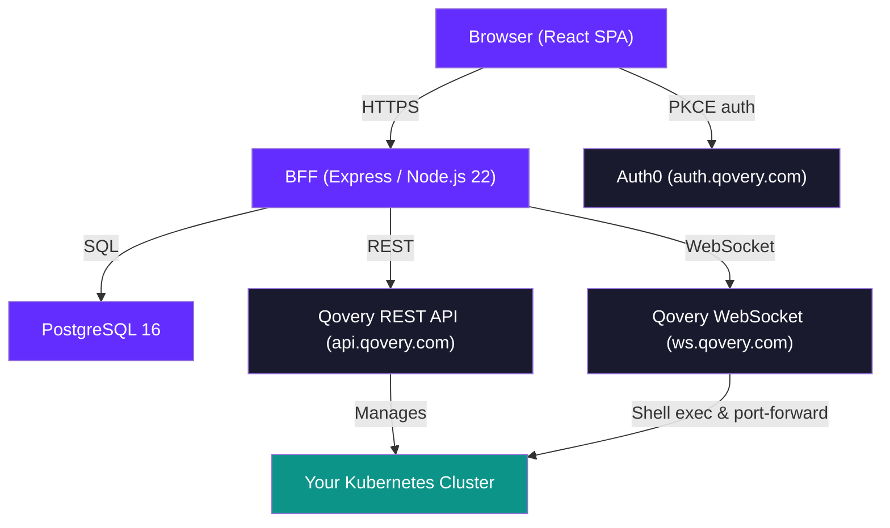
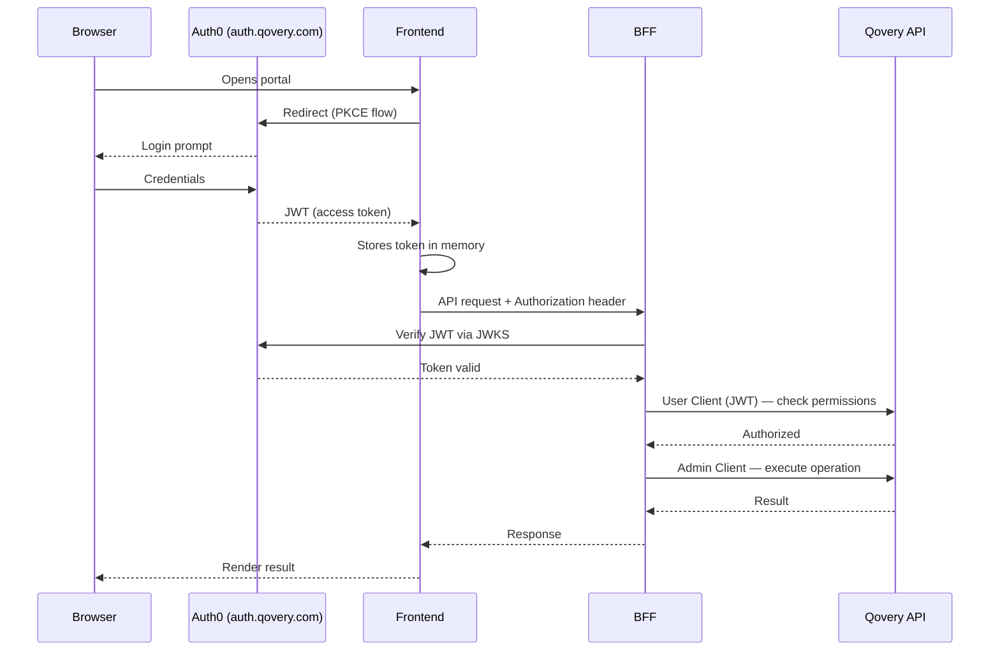
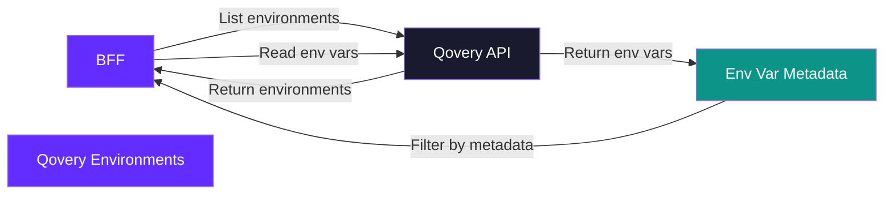
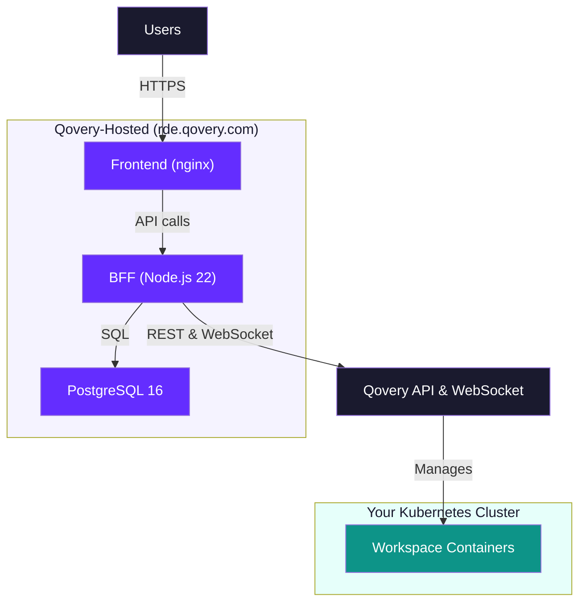

<Warning>
**Preview**: Remote Dev Environments Portal is in preview. Architecture details may change as the product evolves.
</Warning>

## Overview

The RDE Portal is a web application hosted by Qovery at [rde.qovery.com](https://rde.qovery.com). It consists of three components: a **React frontend**, an **Express BFF** (Backend-for-Frontend), and a **PostgreSQL database** — all managed by Qovery. The portal communicates with Qovery's API and WebSocket services to manage workspace containers that run on **your** Kubernetes cluster.

This page explains the architecture, authentication model, and data flow that make the portal work. For security-specific details — data residency, streaming model, token management, and compliance — see the dedicated [Security & Data Residency](/rde/reference/security) page.

## High-Level Architecture

## Components

### Frontend

A **single-page React application** served by nginx. Built with Vite, styled with Tailwind CSS, and using Radix UI primitives for accessible components. TanStack Router handles client-side navigation.

The frontend is responsible for:
- Rendering the workspace dashboard, editor, and admin panels
- Managing Auth0 authentication via the PKCE flow
- Opening WebSocket connections to the BFF for terminal sessions (powered by xterm.js)
- Displaying live previews of running applications in an iframe

The frontend never communicates directly with the Qovery API. All API calls go through the BFF.

### BFF (Backend-for-Frontend)

An **Express 4 server running on Node.js 22** that acts as the gateway between the frontend and Qovery services. The BFF handles:

- **Authentication** — Verifies Auth0 JWTs via JWKS endpoint
- **Authorization** — Enforces blueprint ACLs, workspace ownership, and admin role checks
- **API proxying** — Translates portal operations into Qovery API calls using the [two-client model](#two-client-model)
- **WebSocket relay** — Bridges terminal sessions and port-forward connections between the browser and Qovery's WebSocket services
- **Business logic** — Publish workflows, blueprint discovery, catalog assembly, workspace lifecycle management

<Info>
The BFF maintains an **in-memory cache** with configurable TTLs to reduce load on the Qovery API. Key cache durations: JWKS (10 min), user info (5 min), admin role check (2 min), workspace discovery (30 sec), catalog (60 sec).
</Info>

### PostgreSQL Database

A **PostgreSQL 16 database** that stores portal-specific configuration. The database schema is auto-migrated on BFF startup.

Key tables include:

| Table | Purpose |
|-------|---------|
| `org_config` | Organization settings (admin token, branding, limits) |
| `blueprint_acl` | Access control rules per blueprint |
| `blueprint_settings` | Display configuration for each blueprint |
| `publish_requests` | Pending and completed publish workflows |
| `publish_trust` | Trusted domains for publish targets |
| `portal_user_roles` | Admin and member role assignments |
| `user_tags` | User-defined tags for workspace organization |
| `workspace_tag_assignments` | Tag-to-workspace mappings |
| `preview_tickets` | One-time authentication tickets for preview sessions |

<Note>
The database does **not** store workspace state. Workspace lifecycle (running, stopped, deploying, error) and configuration are managed entirely through the Qovery API.
</Note>

### Qovery API

The portal uses Qovery's REST API (`api.qovery.com`) for all resource management operations: listing projects, cloning environments, deploying services, managing organization members, and reading deployment status. The BFF communicates with this API using both the user's JWT and the admin token.

### Qovery WebSocket

Qovery's WebSocket service (`ws.qovery.com`) provides two capabilities the portal relies on:

- **Shell exec** — Interactive terminal sessions inside running containers
- **Port forwarding** — TCP tunnels to container ports, used for live preview

## Authentication Flow

The frontend authenticates users through **Auth0 (auth.qovery.com)** using the PKCE authorization code flow. The JWT audience is `https://core.qovery.com`, matching Qovery's standard authentication.

On every request to the BFF, the JWT is verified against Auth0's JWKS endpoint. The BFF then uses the token to determine the user's identity and permissions before executing the requested operation.

## Two-Client Model

The BFF maintains **two Qovery API clients** for each authenticated request:

<CardGroup cols={2}>
  <Card title="User Client" icon="user">
    Uses the **user's Auth0 JWT** to call the Qovery API. This verifies that the user has the required RBAC permissions for the requested operation. If the user lacks permissions, the request is rejected before any action is taken.
  </Card>
  <Card title="Admin Client" icon="shield-halved">
    Uses an **organization admin API token** (automatically provisioned when the admin clicks **Configure Portal**) to execute privileged operations. This token enables the portal to perform actions like cloning environments across projects, deploying workspaces, and managing lifecycle — operations that individual users may not have direct permissions for.
  </Card>
</CardGroup>

**Why two clients?** The portal needs to perform operations on behalf of users that those users may not have direct Qovery RBAC permissions for. For example, cloning a blueprint environment into a new project requires admin-level access. The two-client model separates **authorization** (verified via the user's JWT) from **execution** (performed via the admin token).

<Warning>
The admin API token is encrypted with **AES-256-GCM** and stored in the PostgreSQL database. It is never exposed to the frontend or included in any API response. Only the BFF can decrypt and use it.
</Warning>

## Convention-Based Discovery

The portal does **not** maintain a separate database of workspaces. Instead, it discovers workspaces by scanning Qovery environment variables that serve as metadata tags.

When the portal needs to list a user's workspaces, it:

1. Queries the Qovery API for all environments in the organization
2. Reads the environment variables on each environment
3. Filters for environments that contain the RDE metadata tags
4. Matches workspaces to the current user by `RDE_OWNER_EMAIL`

**Key metadata tags:**

| Environment Variable | Purpose |
|---------------------|---------|
| `BLUEPRINT_PROJECT_ID` | Links the workspace to its source blueprint project |
| `BLUEPRINT_KEY` | Identifies the specific blueprint used to create the workspace |
| `RDE_OWNER_EMAIL` | Email address of the user who owns the workspace |
| `RDE_DISPLAY_NAME` | User-friendly name shown in the dashboard |

<Tip>
Because Qovery's API is the single source of truth, there are no sync issues between the portal and Qovery. If you modify a workspace directly in the Qovery Console, the portal reflects the change automatically on the next discovery scan.
</Tip>

## Terminal & Preview

### Terminal (Shell Exec)

The portal provides interactive terminal sessions that connect directly to containers running in your Kubernetes cluster.

**Connection flow:**

1. The frontend requests a **shell ticket** from the BFF — a one-time token with a 30-second TTL
2. The frontend opens a WebSocket to the BFF, passing the shell ticket as authentication
3. The BFF validates the ticket (single-use, not expired) and opens a WebSocket to Qovery's shell exec service
4. Keystrokes and terminal output are relayed bidirectionally between the browser and the container

<Info>
Shell tickets are one-time tokens that expire after 30 seconds. This prevents bearer tokens from appearing in WebSocket URLs, which could be logged by proxies or load balancers.
</Info>

### Live Preview (Port Forward)

The preview panel renders the user's running application in an iframe **without requiring a public URL or ingress configuration**.

**How it works:**

1. The frontend sends HTTP requests to a BFF preview endpoint
2. The BFF tunnels these requests through Qovery's **port-forward WebSocket**, which establishes a TCP connection to the target container port
3. The response is relayed back to the browser and rendered in the iframe

This approach means workspaces do not need public domains, load balancers, or ingress rules for development previews. The BFF acts as the tunnel.

## Deployment Architecture

The RDE Portal uses a **split deployment model**: the portal itself is hosted by Qovery as a managed service at `rde.qovery.com`, while workspace containers run on your Kubernetes cluster.

| Component | Hosted by | Details |
|-----------|-----------|---------|
| **Frontend** | Qovery | Serves the React SPA via nginx |
| **BFF** | Qovery | Express server handling auth, API proxying, WebSocket relay |
| **PostgreSQL** | Qovery | Stores portal configuration (ACLs, theme, publish state) — no user code |
| **Workspace containers** | Your cluster | Isolated environments where development actually happens |

You do not need to deploy or maintain the portal infrastructure — Qovery handles updates, availability, and scaling. You only manage your Kubernetes cluster where workspaces run.

## Data Model

The portal splits data storage between PostgreSQL and the Qovery API:

| Data | Storage | Rationale |
|------|---------|-----------|
| Workspace state (running/stopped) | Qovery API | Qovery manages the actual infrastructure |
| Workspace metadata (owner, name) | Qovery env vars | Convention-based discovery, no sync needed |
| Service logs and events | Qovery API | Native Qovery functionality |
| Blueprint ACLs | PostgreSQL | Portal-specific access control |
| Publish requests and trust rules | PostgreSQL | Portal-specific workflow |
| Theme and branding | PostgreSQL | Portal-specific customization |
| Member roles | PostgreSQL | Portal-specific role assignments |
| User tags | PostgreSQL | Portal-specific workspace organization |

## Next Steps

<CardGroup cols={2}>
  <Card title="Security & Data Residency" icon="shield-check" href="/rde/reference/security">
    How the portal keeps your data on your infrastructure with full admin control.
  </Card>
  <Card title="Troubleshooting" icon="wrench" href="/rde/reference/troubleshooting">
    Common issues and solutions for the RDE Portal.
  </Card>
  <Card title="Admin Setup" icon="gear" href="/rde/getting-started/admin-setup">
    Configure the portal for your organization.
  </Card>
  <Card title="Blueprint Management" icon="cubes" href="/rde/admin/blueprint-management">
    Register and configure workspace templates.
  </Card>
</CardGroup>
