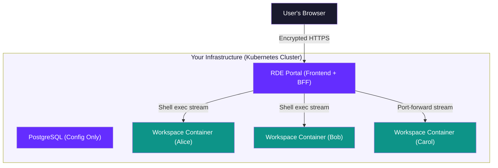
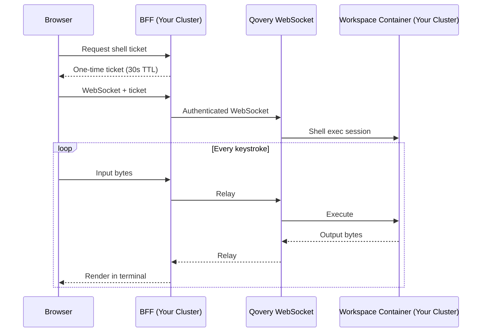

<Warning>
**Preview**: Remote Dev Environments Portal is in preview. Security features are under active development and may evolve.
</Warning>

## Overview

Security is a foundational principle of the RDE Portal. Unlike hosted cloud development environments where your code, data, and AI interactions leave your infrastructure, the RDE Portal is **deployed entirely on your own Qovery-managed Kubernetes cluster**. Nothing leaves your infrastructure — workspaces, terminal sessions, AI interactions, and application previews are all streamed directly from your cluster to the user's browser.

This page explains the security architecture in detail: how data stays on your infrastructure, how the streaming model works, and what controls admins have.

## Your Infrastructure, Your Data

The RDE Portal follows a **zero data exfiltration** model. Every component runs on your infrastructure:

| Component | Where it runs | What it stores |
|-----------|---------------|----------------|
| **Frontend (nginx)** | Your cluster | Nothing — serves static files |
| **BFF (Node.js)** | Your cluster | Processes requests in memory, no data persisted to disk |
| **PostgreSQL** | Your cluster | Portal configuration only (ACLs, theme, publish settings). No source code, no user data. |
| **Workspace containers** | Your cluster | Source code, dependencies, environment variables — isolated per user |
| **Terminal sessions** | Your cluster | Streamed in real time, not stored by the portal |
| **AI chat & Claude Code** | Your cluster (via workspace container) | AI interactions happen inside the container on your cluster |
| **Live previews** | Your cluster | HTTP traffic proxied from your container, never cached |

<Note>
**No source code, AI conversations, terminal history, or application data is stored outside your Kubernetes cluster.** The portal's PostgreSQL database only stores configuration metadata (ACL rules, theme colors, publish workflow state). Your actual development work lives exclusively in the workspace containers on your infrastructure.
</Note>

## How Streaming Works

The portal does not copy data out of your infrastructure. Instead, it **streams** everything in real time from the workspace containers to the user's browser through the BFF.

### Terminal Streaming

When a user opens a terminal tab, the portal establishes a WebSocket chain:

Every keystroke and terminal output byte is **streamed** through the chain in real time. The BFF relays data without storing it. When the session ends, there is no recording or history kept by the portal — only the workspace container retains its filesystem state.

**Shell ticket security:** Terminal connections use one-time authentication tickets with a 30-second TTL. This prevents bearer tokens from appearing in WebSocket URLs, which could be captured by proxies, load balancers, or browser history.

### Preview Streaming

The live preview works the same way — HTTP requests are tunneled from the browser through the BFF to the workspace container via Qovery's port-forward WebSocket:

1. The browser requests a page from the BFF's preview endpoint
2. The BFF opens a TCP tunnel to the container's application port via Qovery's port-forward service
3. The HTTP response is relayed back to the browser and rendered in the iframe
4. No caching, no storage — the response is streamed directly

**No public URLs needed.** Workspace applications are never exposed to the internet. The BFF acts as the only entry point, authenticated and authorized on every request.

### AI Tool Streaming

Claude Code and the OpenCode chat panel run **inside the workspace container**, not on an external server. When a user interacts with AI tools:

1. The AI process runs inside the workspace container on your cluster
2. The AI process communicates with the LLM provider (Anthropic, OpenAI, or your custom provider) directly from the container
3. The portal streams the terminal/chat UI to the browser — it does not intercept or store AI conversations

<Info>
If your organization requires that AI traffic also stays within your network, you can configure a custom LLM provider endpoint (e.g., an internally hosted model or a private API gateway) in the blueprint settings.
</Info>

## Admin Controls

Platform engineers have full control over every aspect of the portal:

### Infrastructure Control

- **You own the deployment** — The portal runs on your Qovery cluster. You control the infrastructure, networking, and resource limits.
- **You own the database** — PostgreSQL is deployed on your infrastructure. No portal data is stored on external servers.
- **You control the network** — Workspace containers run in your cluster's network. Apply your existing network policies, security groups, and firewall rules.
- **You control the images** — Blueprint container images are pulled from your container registry. You decide what software is available in workspaces.

### Access Control

- **Blueprint ACLs** — Restrict which blueprints are available to which users by email address, email domain, or open access. Users only see blueprints they're authorized to use.
- **Workspace limits** — Set the maximum number of running workspaces per user to control resource consumption and costs.
- **Publish approvals** — Require admin review before any workspace can be published to production. Trusted users can bypass this, but trust is granted per-user and revocable.
- **Member management** — Control who has access to the portal and assign roles (admin or user).
- **SSO authentication** — Users authenticate via Qovery SSO (Auth0). No separate user database, no additional passwords.

### Workspace Isolation

Each workspace is a **separate Qovery environment** running as isolated containers on your Kubernetes cluster:

- Workspaces are created by cloning a blueprint into a **new Qovery project**. Each user's workspace is a distinct project with its own RBAC scope.
- Users cannot access other users' workspaces through the portal. The BFF enforces ownership checks on every API call.
- Qovery's RBAC system provides an additional layer of isolation — workspace-scoped roles ensure users can only interact with their own resources.
- Workspace containers run with the resource limits defined in the blueprint. Admins control CPU, memory, and storage allocations.

### Audit & Visibility

- **All workspace operations** (create, start, stop, delete, publish) are logged through Qovery's audit trail
- **Publish workflow** maintains a full history of requests, approvals, and rejections with timestamps and reviewer identity
- **Admin dashboard** provides real-time visibility into all workspaces across the organization: who created them, their status, and which blueprint they're based on

## Token & Secret Management

The portal handles several types of credentials, each with specific security measures:

| Credential | Protection |
|-----------|------------|
| **User JWT (Auth0)** | Short-lived access token, verified via JWKS on every request. Stored in browser memory only (not localStorage). |
| **Admin API Token** | Encrypted with **AES-256-GCM** using a 256-bit key. Stored encrypted in PostgreSQL. Only the BFF can decrypt it at runtime. Never exposed to the frontend. |
| **Shell Tickets** | One-time use, 30-second TTL. Invalidated after first use. Prevents token leakage in WebSocket URLs. |
| **Preview Tickets** | One-time use, short TTL. Authenticates preview iframe requests without exposing the user's JWT. |
| **LLM API Keys** | Stored encrypted in PostgreSQL (AES-256-GCM). Injected into workspace containers as environment variables at runtime. Never visible in the portal UI after initial configuration. |

<Warning>
The **TOKEN_ENCRYPTION_KEY** environment variable used by the BFF must be a 64-character hex string (256 bits). Keep this key secure — it protects all encrypted credentials in the database. Rotate it by re-encrypting stored values with a new key.
</Warning>

## Network Security

### External Communication

The only external communication from the portal is:

| Destination | Purpose | Protocol |
|------------|---------|----------|
| `auth.qovery.com` | JWT verification (JWKS) | HTTPS |
| `api.qovery.com` | Resource management | HTTPS |
| `ws.qovery.com` | Shell exec and port forwarding | WSS (WebSocket Secure) |

All communication uses TLS encryption. No other external endpoints are contacted by the portal.

### Internal Communication

- Frontend to BFF: HTTPS within your cluster
- BFF to PostgreSQL: Encrypted connection within your cluster
- BFF to workspace containers: Via Qovery's WebSocket service (no direct container access)

### Rate Limiting

The BFF enforces rate limits to prevent abuse:

- **Workspace launch**: Configurable limit per minute (default: 5 per minute)
- **Global API requests**: Configurable limit per minute (default: 200 per minute)
- Standard HTTP security headers via Helmet middleware
- CORS configured to allow only your portal's origin

## Comparison with Hosted Alternatives

| Aspect | RDE Portal (Self-Hosted) | Hosted Cloud IDEs |
|--------|--------------------------|-------------------|
| **Where code lives** | Your Kubernetes cluster | Vendor's infrastructure |
| **Where AI runs** | Your containers | Vendor's servers |
| **Data residency** | Your cloud account, your region | Vendor's cloud, vendor's region |
| **Network control** | Your VPC, your security groups | Shared infrastructure |
| **Admin control** | Full — blueprints, ACLs, limits, approvals | Limited to vendor's settings |
| **Compliance** | Inherits your cluster's compliance posture (SOC 2, HIPAA, GDPR, DORA) | Depends on vendor certification |
| **Audit trail** | Your Qovery audit logs | Vendor's logs |
| **Customization** | Full — branding, layouts, AI providers | Limited |

<Tip>
Because the RDE Portal runs on your existing Qovery cluster, it inherits your cluster's compliance certifications. If your cluster is SOC 2, HIPAA, or GDPR compliant, the portal workspaces are too — no additional certification needed.
</Tip>

## Summary

The RDE Portal security model can be summarized in three principles:

1. **Everything runs on your infrastructure.** The portal, the database, and every workspace container run on your Kubernetes cluster. No code or data leaves your environment.

2. **Everything is streamed, nothing is stored.** Terminal sessions, AI interactions, and application previews are streamed in real time from your containers to the user's browser. The portal relays data without persisting it.

3. **Admins control everything.** From blueprint templates to access control rules to publish approvals — platform engineers have full visibility and control over what happens in the portal.

## Next Steps

<CardGroup cols={3}>
  <Card title="Architecture" icon="sitemap" href="/rde/reference/architecture">
    Deep dive into the portal's technical architecture.
  </Card>
  <Card title="Access Control" icon="shield-halved" href="/rde/admin/access-control">
    Configure who can access which blueprints.
  </Card>
  <Card title="Admin Setup" icon="gear" href="/rde/getting-started/admin-setup">
    Get the portal running on your infrastructure.
  </Card>
</CardGroup>
