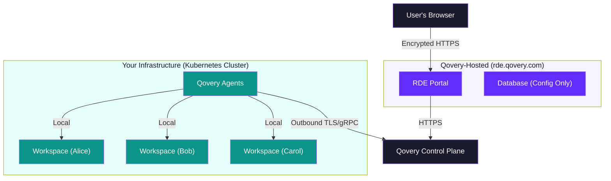
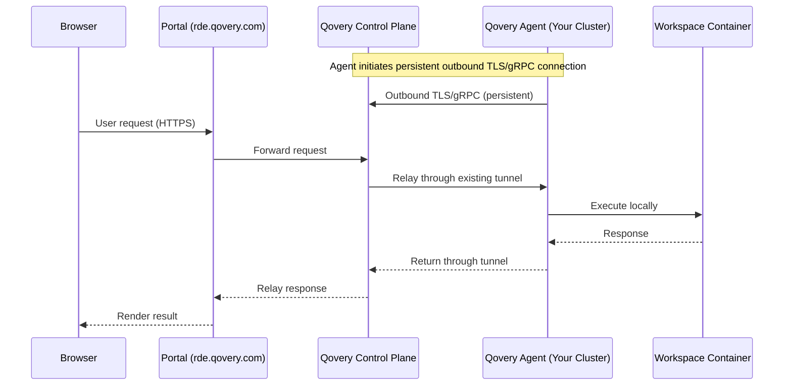
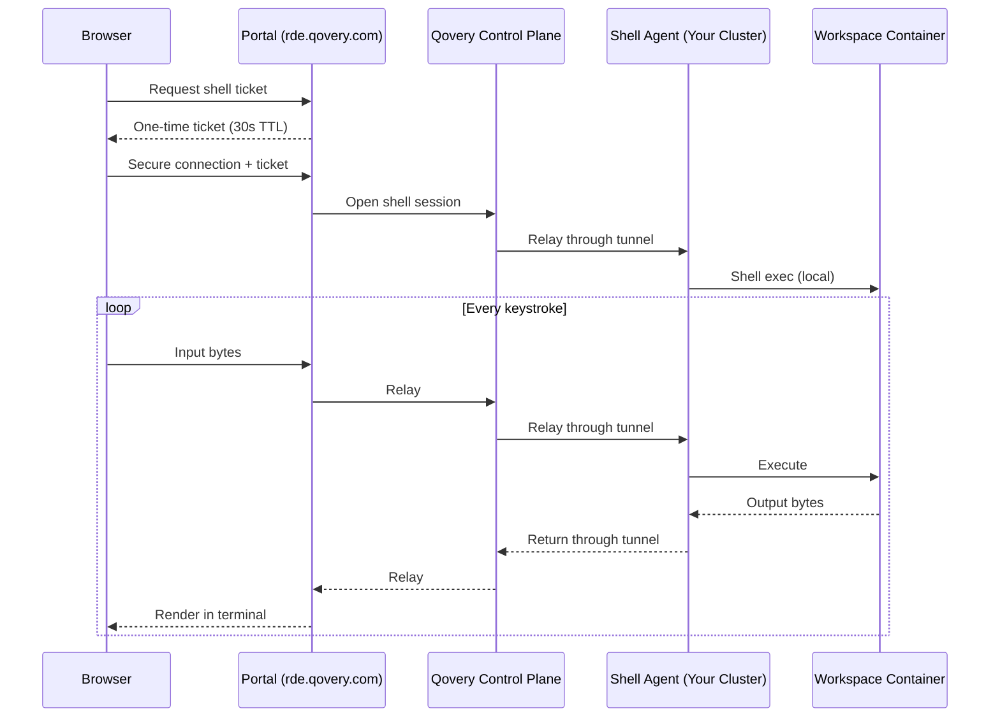

<Warning>
**Preview**: Remote Dev Environments Portal is in preview. Security features are under active development and may evolve.
</Warning>

## Overview

Security is a foundational principle of the RDE Portal. The portal uses a **split architecture**: the control plane (portal UI and API) is hosted by Qovery at `rde.qovery.com`, while the **data plane** (workspace containers where your code, AI interactions, and applications run) stays **entirely on your own Kubernetes cluster**.

**Your cluster is never exposed to the internet.** Qovery agents running on your cluster initiate all connections **outbound** to the Qovery control plane via TLS/gRPC. The control plane never connects inbound to your infrastructure. Source code, AI conversations, and development data never leave your cluster.

This page explains the security architecture in detail: the connectivity model, how data streams from your infrastructure, and what controls admins have.

## Split Architecture: Control Plane vs. Data Plane

The RDE Portal separates **orchestration** from **execution**. Qovery hosts the portal that manages the workflow. Your cluster hosts the workspaces where actual development happens.

**Key:** All arrows from your cluster point **outbound**. Your infrastructure has no inbound ports open. The Qovery agents on your cluster are the only components that communicate externally, and they only make outbound TLS/gRPC connections.

| Component | Where it runs | What it stores |
|-----------|---------------|----------------|
| **RDE Portal** | Qovery (rde.qovery.com) | Portal configuration (ACLs, theme, publish settings). Relays streaming traffic in memory - no code persisted. |
| **Portal Database** | Qovery (rde.qovery.com) | Configuration metadata only. No source code, no user data, no AI conversations. |
| **Qovery Agents** | Your cluster | No persistent storage - agents relay traffic between the control plane and workspace containers. |
| **Workspace containers** | Your cluster | Source code, dependencies, environment variables - isolated per user |
| **Terminal sessions** | Your cluster | Happen inside your containers, streamed to the browser through the cluster-initiated tunnel |
| **AI chat & Claude Code** | Your cluster (via workspace container) | AI interactions happen inside the container on your cluster |
| **Live previews** | Your cluster | HTTP traffic from your container, relayed through the tunnel, never cached |

<Note>
**No source code, AI conversations, terminal history, or application data is stored outside your Kubernetes cluster.** The portal's database only stores configuration metadata (ACL rules, theme colors, publish workflow state). Your actual development work lives exclusively in the workspace containers on your infrastructure.
</Note>

## Cluster Connectivity Model

This is the most important security property of the RDE Portal.

Your Kubernetes cluster runs **Qovery agents** (Engine, Shell agent, and other components) that maintain persistent **outbound TLS/gRPC connections** to the Qovery control plane. Your cluster never exposes inbound ports to the internet - it is never directly addressable from outside your network.

All portal operations flow through this cluster-initiated tunnel:

1. **Qovery agents on your cluster** establish and maintain outbound TLS/gRPC connections to the Qovery control plane. This is the only external communication from your cluster.
2. **The portal** sends requests to the Qovery control plane.
3. **The control plane** relays the request through the already-established tunnel to the agent on your cluster.
4. **The agent** executes the operation locally - shell session, port forward, deployment - and returns the result through the same tunnel.

<Note>
**No inbound ports. No public endpoints. No direct access to your cluster.** The control plane can only communicate with your cluster through the tunnel that your agents initiated. If the agents stop, the tunnel closes - the control plane has no way to reach your infrastructure.
</Note>

## How Streaming Works

The portal does not copy data out of your infrastructure. Instead, it **streams** everything in real time from the workspace containers on your cluster through the cluster-initiated tunnel to the user's browser. The portal relays data in memory and never persists it.

### Terminal Streaming

When a user opens a terminal tab:

Every keystroke and terminal output byte is **streamed** through the chain in real time. The portal relays data without storing it. When the session ends, there is no recording or history kept by the portal - only the workspace container retains its filesystem state.

**Shell ticket security:** Terminal connections use one-time authentication tickets with a 30-second TTL. This prevents bearer tokens from appearing in connection URLs, which could be captured by proxies, load balancers, or browser history.

### Preview Streaming

The live preview works the same way - HTTP requests are tunneled through the cluster-initiated tunnel to your workspace container:

1. The browser requests a page from the portal's preview endpoint
2. The portal forwards the request to the Qovery control plane
3. The control plane relays the request through the **cluster-initiated tunnel** to the Qovery agent on your cluster
4. The agent forwards the request to the container's application port **locally**
5. The response flows back through the same tunnel to the browser
6. No caching, no storage - the response is streamed directly

**No public URLs needed.** Workspace applications are never exposed to the internet. Your cluster has no inbound ports open - all traffic flows through the outbound tunnel initiated by the agents.

### AI Tool Streaming

Claude Code and the OpenCode chat panel run **inside the workspace container**, not on an external server. When a user interacts with AI tools:

1. The AI process runs inside the workspace container on your cluster
2. The AI process communicates with the LLM provider (Anthropic, OpenAI, or your custom provider) directly from the container
3. The portal streams the terminal/chat UI to the browser through the tunnel - it does not intercept or store AI conversations

<Info>
If your organization requires that AI traffic also stays within your network, you can configure a custom LLM provider endpoint (e.g., an internally hosted model or a private API gateway) in the blueprint settings.
</Info>

## Admin Controls

Platform engineers have full control over every aspect of the portal:

### Infrastructure Control

- **Your workspaces, your cluster** - Workspace containers run on your Qovery-managed Kubernetes cluster. You control the infrastructure, networking, and resource limits for all workspaces.
- **No inbound ports** - Your cluster never exposes ports to the internet. Qovery agents initiate all connections outbound via TLS/gRPC.
- **You control the network** - Workspace containers run in your cluster's network. Apply your existing network policies, security groups, and firewall rules.
- **You control the images** - Blueprint container images are pulled from your container registry. You decide what software is available in workspaces.
- **Portal managed by Qovery** - The portal control plane is hosted and operated by Qovery at `rde.qovery.com`. Zero deployment overhead for you - Qovery handles updates, availability, and scaling.

### Access Control

- **Blueprint ACLs** - Restrict which blueprints are available to which users by email address, email domain, or open access. Users only see blueprints they're authorized to use.
- **Workspace limits** - Set the maximum number of running workspaces per user to control resource consumption and costs.
- **Publish approvals** - Require admin review before any workspace can be published to production. Trusted users can bypass this, but trust is granted per-user and revocable.
- **Member management** - Control who has access to the portal and assign roles (admin or user).
- **SSO authentication** - Users authenticate via Qovery SSO. No separate user database, no additional passwords.

### Workspace Isolation

Each workspace is a **separate Qovery environment** running as isolated containers on your Kubernetes cluster:

- Workspaces are created by cloning a blueprint into a **new Qovery project**. Each user's workspace is a distinct project with its own RBAC scope.
- Users cannot access other users' workspaces through the portal. Ownership checks are enforced on every API call.
- Qovery's RBAC system provides an additional layer of isolation - workspace-scoped roles ensure users can only interact with their own resources.
- Workspace containers run with the resource limits defined in the blueprint. Admins control CPU, memory, and storage allocations.

### Audit & Visibility

- **All workspace operations** (create, start, stop, delete, publish) are logged through Qovery's audit trail
- **Publish workflow** maintains a full history of requests, approvals, and rejections with timestamps and reviewer identity
- **Admin dashboard** provides real-time visibility into all workspaces across the organization: who created them, their status, and which blueprint they're based on

## Token & Secret Management

The portal handles several types of credentials, each with specific security measures:

| Credential | Protection |
|-----------|------------|
| **User JWT** | Short-lived access token, verified on every request. Stored in browser memory only (not localStorage). |
| **Admin API Token** | Automatically provisioned when an admin clicks **Configure Portal**. Encrypted with **AES-256-GCM** using a 256-bit key. Stored encrypted in the portal database. Never exposed to the frontend. |
| **Shell Tickets** | One-time use, 30-second TTL. Invalidated after first use. Prevents token leakage in connection URLs. |
| **Preview Tickets** | One-time use, short TTL. Authenticates preview requests without exposing the user's JWT. |
| **LLM API Keys** | Stored encrypted with **AES-256-GCM** in the portal database. Injected into workspace containers as environment variables at runtime. Never visible in the portal UI after initial configuration. |

<Info>
The admin API token is created automatically when an organization admin first configures the portal - no manual token generation or pasting required. The token is encrypted immediately and never displayed in the UI.
</Info>

## Network Security

### Cluster Communication

Your cluster's Qovery agents maintain persistent **outbound TLS/gRPC connections** to the Qovery control plane. This is the only external communication from your cluster:

| Direction | From | To | Protocol |
|-----------|------|------|----------|
| **Outbound** | Qovery Agents (your cluster) | Qovery Control Plane | TLS/gRPC |
| **None** | Internet | Your cluster | No inbound ports |

The control plane relays portal requests through these agent-initiated tunnels. Your cluster is never directly addressable from the internet.

### Portal Communication

All communication between portal components and Qovery services uses TLS encryption:

| From | To | Protocol |
|------|------|----------|
| User's browser | Portal (rde.qovery.com) | HTTPS |
| Portal | Qovery Control Plane | HTTPS / WSS |
| Portal | Auth provider | HTTPS |

### Rate Limiting

The portal enforces rate limits to prevent abuse:

- **Workspace launch**: Configurable limit per minute (default: 5 per minute)
- **Global API requests**: Configurable limit per minute (default: 200 per minute)
- Standard HTTP security headers on all responses

## Comparison with Hosted Alternatives

Non-technical teams across your organization are already using AI-powered builder tools like Lovable, Bolt.new, and Replit to create applications - often with company data and without IT oversight. These platforms offer consumer-grade governance: shared multi-tenant infrastructure, limited networking controls, no VPC peering, and incomplete audit trails. The RDE Portal provides the same ease of use with enterprise-grade security - your code and data stay on your infrastructure.

<Info>
For a detailed analysis, read [Lovable, Bolt, and Replit Are Wonderful - Until Your CISO Finds Out](https://www.qovery.com/blog/lovable-bolt-replit-enterprise-limitations).
</Info>

| Aspect | RDE Portal | External AI Builders (Lovable, Bolt, Replit) |
|--------|-----------|------------------------|
| **Where code lives** | Your Kubernetes cluster | Vendor's shared infrastructure |
| **Where AI runs** | Your containers | Vendor's servers |
| **Cluster exposure** | No inbound ports - agents connect outbound | N/A - no self-hosting |
| **Data residency** | Your cloud account, your region | Vendor's cloud, vendor's region |
| **Network control** | Your VPC, your security groups | No VPC peering, no private networking |
| **SSO / Identity** | Qovery SSO - same corporate identity | Varies - often requires premium plan |
| **Admin control** | Full - blueprints, ACLs, limits, approvals | Limited to vendor's settings |
| **Compliance** | Workspaces inherit your cluster's posture (SOC 2, HIPAA, GDPR, DORA) | Depends on vendor certification |
| **Audit trail** | Full audit via Qovery | Limited or unavailable |
| **Customization** | Full - branding, layouts, AI providers | Limited |
| **Portal operations** | Managed by Qovery (zero maintenance) | Managed by vendor |

<Tip>
Because workspace containers run on your existing Qovery cluster, they inherit your cluster's compliance certifications. If your cluster is SOC 2, HIPAA, or GDPR compliant, your workspaces are too - no additional certification needed for the data plane.
</Tip>

## Summary

The RDE Portal security model can be summarized in three principles:

1. **Your code and data stay on your infrastructure.** Workspace containers run on your Kubernetes cluster. Source code, AI conversations, terminal history, and application data never leave your environment. The portal control plane (hosted by Qovery) manages orchestration and configuration only.

2. **Your cluster is never exposed.** Qovery agents on your cluster initiate all connections outbound via TLS/gRPC. No inbound ports, no public endpoints, no direct access to your infrastructure from the internet.

3. **Everything is streamed, nothing is stored.** Terminal sessions, AI interactions, and application previews are streamed in real time from your containers through the cluster-initiated tunnel to the user's browser. The portal relays data without persisting it.

## Next Steps

<CardGroup cols={3}>
  <Card title="Architecture" icon="sitemap" href="/rde/reference/architecture">
    Deep dive into the portal's technical architecture.
  </Card>
  <Card title="Access Control" icon="shield-halved" href="/rde/admin/access-control">
    Configure who can access which blueprints.
  </Card>
  <Card title="Admin Setup" icon="gear" href="/rde/getting-started/admin-setup">
    Configure the portal for your organization.
  </Card>
</CardGroup>
